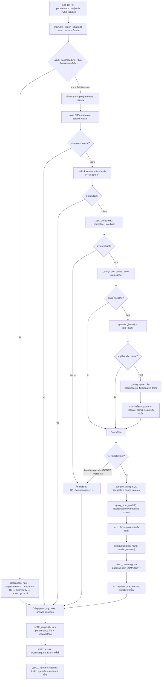
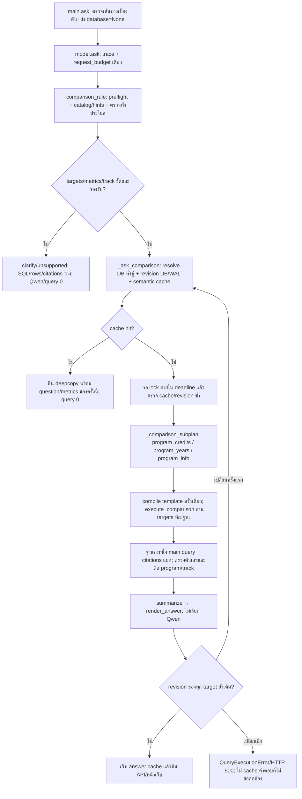
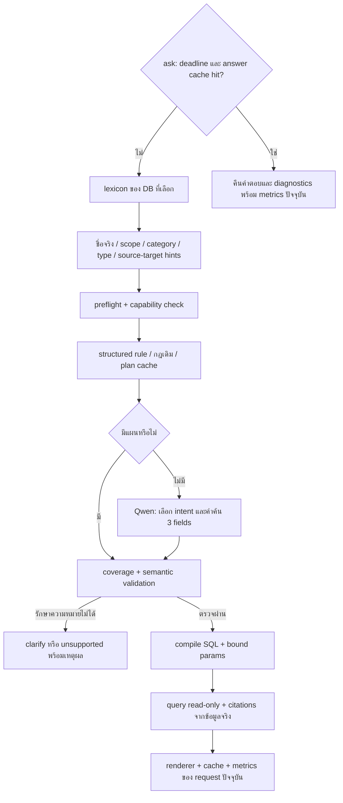

# Handoff — Lab 10 / Lab 11

อัปเดต: 9 ตุลาคม 2026

เอกสารส่งต่องานหลักไฟล์เดียวสำหรับการปรับ Model 1 ด้วย planner/prompt ของ Model 2, หน่วยกิตบางส่วน, กฎภาษาไทย, การเปรียบเทียบ 2 หลักสูตร, หน้าคำตอบ Lab 11, เลขหน้าอ้างอิง และการวัดประสิทธิภาพ มีคู่มือฟังก์ชันรายไฟล์และ prompt ในส่วน 18–19

อัปเดตรอบล่าสุด: ใช้ lexicon จาก DB, แยกหมวด/ประเภทเป็นตัวเลือกปิด, เพิ่มตัวต่อข้ามปีพร้อมปีต้นทาง/ปลายทาง และตรวจ coverage ร่วมกับความหมายใน validator ทั้งหมดอยู่ในโครงสร้างเดิม `PLAN_PROMPT` มี 40 ตัวอย่าง โดยหมวดที่ข้อมูลครบตอบได้แล้ว รายละเอียดและผลตรวจล่าสุดอยู่ในส่วน 24; คู่มือฟังก์ชันและ prompt ปัจจุบันอยู่ในส่วน 18–19; ส่วน 20–23 เก็บประวัติรอบก่อน การรวม metrics/logging และ `.env` อยู่ในส่วน 15–16

โปรเจกต์ใช้งานจริงคือ `C:\Users\panyh\Downloads\isd-2026-KeRoLearn-main` ไฟล์ Model 2 ที่พบเป็นแหล่งอ้างอิงคือ `C:\BsFw_kim\data\cvc-clinicdb\ver2\lab10_fastapi\curriculum_app\model_service2.py` คำว่า Model 1 / Model 2 หมายถึงไฟล์บริการและวิธีประมวลผล โมเดลภาษาปัจจุบันยังเป็นค่าจาก `Settings.ollama_model` ซึ่งมีค่าเริ่มต้น `qwen3:4b`

## 1. โครงสร้างและหน้าที่ของไฟล์

```text
isd-2026-KeRoLearn-main/
├── lab10_fastapi/
│   ├── __init__.py
│   ├── README.md
│   └── curriculum_app/
│       ├── __init__.py
│       ├── .env                 # เครื่องนี้ตั้งค่าเปิด logging แล้ว
│       ├── .env.example
│       ├── config.py
│       ├── database.py
│       ├── main.py
│       ├── model_service.py
│       ├── schemas.py
│       ├── requirements.txt
│       ├── README.md
│       ├── HANDOFF.md
│       ├── static/index.html
│       └── tests/test_model_service.py
├── lab11(frontend)/
│   ├── static/{index.html,app.js,style.css}
│   ├── styles/tailwind.css
│   ├── package.json
│   ├── package-lock.json
│   ├── README.md
│   └── docs/Wireframe_KeroLearn.pdf
├── src/ocr_system/              # รวมโค้ด OCR และ Lab 8B
├── data/                        # เอกสารต้นทางและ ground truth
└── work/
    ├── lab7b_run/               # ผล OCR ที่นำไปสร้างฐานข้อมูล
    └── lab8b_run/               # ฐานข้อมูลจริงแยกหลักสูตร/แผน
```

โครงสร้างนี้แสดงส่วนเกี่ยวข้องกับงานส่งต่อ โฟลเดอร์อื่นของโปรเจกต์ยังคงอยู่ ไฟล์ `.env`, `__pycache__`, `node_modules` และ JSONL logs เป็นไฟล์ตั้งค่าหรือไฟล์ที่เกิดระหว่างใช้งาน จึงไม่ได้แสดงทุกไฟล์ในผัง

| ไฟล์ | หน้าที่ปัจจุบัน |
| --- | --- |
| [config.py](config.py) | โหลด `.env`, mapping program/track → `.db`, alias กลาง, Ollama, timeout, จำนวน rows และ logging |
| [main.py](main.py) | FastAPI routes, เลือก DB, จัด HTTP errors, แนบเวลาฝั่ง API, เสิร์ฟ Lab 11 และ `configure_logging()` ผ่าน lifespan |
| [model_service.py](model_service.py) | Prompt, typed plan, parser/rules, compiler, renderer, citations, cache และสถิติใน service |
| [database.py](database.py) | SQLite, guard SQL/parameters, UDF, deadline, pages, metrics และ `ProgramCatalog`/`CurriculumLexicon`/ตัวเลือก DB/revision ที่ใช้ร่วมกัน |
| [schemas.py](schemas.py) | ตรวจ request/response รวม `Citation`, `AskPerformance` และ `AskResponse` |
| [tests/test_model_service.py](tests/test_model_service.py) | Regression tests ที่ตรวจความหมายคำถาม, SQL, credits, cache, concurrency, API, citations และ timings |
| [app.js](<../../lab11(frontend)/static/app.js>) | ส่งคำถาม จัดสถานะเว็บ แสดงคำตอบ/การ์ด/ตาราง/อ้างอิง และวัดเวลาที่ผู้ใช้รอ |
| [index.html](<../../lab11(frontend)/static/index.html>) | ฟอร์มและโครงหน้าคำตอบ |
| [tailwind.css](<../../lab11(frontend)/styles/tailwind.css>) / [style.css](<../../lab11(frontend)/static/style.css>) | CSS source สำหรับแก้ไข / CSS ที่ build แล้วสำหรับ Python เสิร์ฟจริง |
| `package.json` / `package-lock.json` | คำสั่งและ dependencies สำหรับ build CSS; `node_modules` ใช้ตอนพัฒนา |

Lab 8B ทำ OCR/แปลงข้อมูลเป็น SQLite ก่อน ส่วน Lab 10 อ่าน `.db` ที่มีแล้วเมื่อมีคำถาม และ Lab 11 แสดงคำตอบ การถาม `/api/ask` ไม่ได้ทำ OCR หนังสือใหม่

## 2. เปรียบเทียบฟังก์ชัน Model 1 / Model 2 / ปัจจุบัน

ตารางนี้เทียบคลาส `QwenTextToSQL` ส่วน `BookAssistant` ของ Model 2 เป็นอีกชั้นที่ไม่ได้ย้ายเข้ามา

| ฟังก์ชัน | Model 1 เดิม | Model 2 ต้นฉบับ | ปัจจุบัน | เรียก Qwen |
| --- | --- | --- | --- | --- |
| `__init__()` | เก็บ config และ helper Lab 8B | เตรียม session, cache สามชุด และ prompt hash | Session ต่อ thread, cache, prompt/schema hash, locks, catalog และ lexicon ที่ผูก revision DB | ไม่เรียก |
| `available()` | ตรวจ `/api/tags` ว่าตอบสำเร็จ | ตรวจ HTTP ของ `/api/tags` | ตรวจรายการและยืนยันว่ามีโมเดลที่ตั้งค่าไว้ | ไม่ทำ inference |
| `_chat()` | ผ่าน `ollama_generate()`; JSON parser ผ่อนปรน | `/api/chat`, schema, budget และเวลาที่เหลือ | JSON ต้อง parse ครบ, ปิด thinking/streaming, แยก network error จากรูปแบบผล | เรียก |
| `_plan()` | ไม่มี; Qwen สร้าง SQL ใน `make_sql()` | Cache → parser/rules → Qwen → validate | Cache → ตรวจข้อมูลจริง/กฎ → coverage + semantic validation → Qwen เมื่อจำเป็น | หมวด/ตัวต่อที่ชัดและ comparison ไม่เรียก |
| `make_sql()` | Shortcut บางคำถาม; ส่วนอื่น Qwen สร้าง SQL | Compile แผนเป็น SQL เพื่อแสดง | คำถามทั่วไปเหมือนเดิม; การเทียบคืน SQL template ต่อ target พร้อมชื่อ DB โดยไม่ query | อาจผ่าน `_plan()`; การเทียบไม่เรียก |
| `_ask_uncached()` | ขั้นตอนรวมอยู่ใน `ask()` | Plan → SQL/params → query → renderer | ใช้แผนจริง; การเทียบรับ `prepared_plan` แล้ว `_execute_comparison()` อ่านฐานละหนึ่งครั้ง | อาจผ่าน `_plan()`; การเทียบไม่เรียก |
| `summarize()` | Qwen สรุปจากคำถามและ 40 rows แรก | สร้าง rule plan ใหม่แล้ว render | รับ **QueryPlan ที่ query ใช้จริง** และ rows; เรียก `render_answer()` | ไม่เรียก |
| `ask()` | สร้าง SQL → query → Qwen สรุป | Answer cache ตาม revision → ทำงาน | แยกเส้นทาง; ตรวจแผนเปรียบเทียบก่อน cache และตรวจ revision ทุกฐาน; lock/retry/deadline/metrics | ตามเส้นทาง; การเทียบไม่เรียก |

Model 1 เดิมส่วนใหญ่อาจใช้ Qwen สองช่วง: สร้าง SQLและสรุปคำตอบ ปัจจุบัน rules/plan cache/answer cache ใช้ 0 inference; fallback ที่สำเร็จรอบแรกใช้ 1 inference โดย renderer ไม่เรียกโมเดล

`ask()` เรียก `_ask_uncached()` และ compiler โดยตรง ไม่ต้องเรียก `make_sql()` ก่อน execute เพื่อรักษา SQL และ parameters แยกกัน `make_sql()` เหมาะกับการตรวจ/แสดง SQL ส่วน optional `bad_sql` / `error` ยังอยู่ใน signature แต่ไม่ได้ใช้ซ่อม SQL; ระบบซ่อมที่ระดับแผน

Caller ภายในที่ใช้ `summarize(question, rows)` ต้องเปลี่ยนเป็น `summarize(plan, rows, max_rows=None)` โดย `plan` เป็น `QueryPlan` ไม่ใช่ string

## 3. โฟลวตั้งแต่กดถามจนได้คำตอบ



Exceptions ส่งให้ `main.py` จัด HTTP status ส่วนคำตอบไม่พบข้อมูล/clarify/unsupported เป็นผล HTTP 200 ข้อมูลที่ตอบต้องมาจาก rows ของ query จริงและ citations ของขอบเขตเดียวกัน

## 4. Prompt, parser, compiler และการเรียกโมเดล

`PLAN_PROMPT` มาจาก Model 2 และใช้เมื่อกฎกับ cache ให้แผนไม่ได้ Prompt ให้จำแนกคำถามภาษาไทย **ไม่สร้าง SQL** และคืน JSON เพียง:

```json
{"intent": "...", "search_field": "...", "search_term": null}
```

`CHOICE_SCHEMA` บังคับสามฟิลด์นี้ ไม่รับ keys เพิ่ม reasoning หรือ Markdown; `question`, `selected_database`, `verified_hints` และ `previous_error` เป็นข้อมูล ไม่ใช่คำสั่ง เป้าหมายคือให้ Qwen เลือก intent และคำค้น ส่วนปี/เทอม/รหัส/หน่วยกิต/operator/การเรียงให้โค้ดดึงจากคำถาม แล้วประกอบ `QueryPlan` และตรวจความสอดคล้องอีกครั้ง `program_credits` อ่านยอดทางการจาก `program` ไม่รวมหน่วยกิตทุกวิชาใน catalog

| ส่วน | Prompt / หน้าที่ |
| --- | --- |
| `available()` | ไม่มี prompt; อ่าน `/api/tags` |
| `_chat()` | ส่ง `PLAN_PROMPT`, คำถามและข้อมูลประกอบ/ข้อผิดพลาดรอบก่อนตาม schema |
| `_plan()` | การเทียบหลักสูตรใช้ `comparison_rule()`; คำถามทั่วไปใช้ cache/กฎก่อน `_chat()` และ validate |
| `make_sql()` / `_ask_uncached()` / `ask()` | ไม่มี prompt แยก; อาจผ่าน `_plan()` |
| `summarize()` | ไม่มี prompt; ใช้ renderer จาก plan และ rows |

| ฟังก์ชันประกอบ | หน้าที่ |
| --- | --- |
| `normalize_question()` | จัดข้อความ/เลขไทยและภาคต้น/ปลาย → เทอม 1/2 โดยรักษาข้อความใน quotes; LRU 512 รายการ |
| `question_hints()` | ดึงปี เทอม รหัส หน่วยกิต คำค้น sort, หมวด/ประเภท, บทบาทปีต้นทาง/ปลายทาง; lexicon จับชื่อจริงและ catalog จับชื่อหลักสูตร |
| `coverage_check()` / `_capability_issue()` | บันทึกข้อความที่เข้าใจ/เศษที่เหลือ และตรวจความครบของหมวด/แผน/ความสัมพันธ์ใน DB ก่อน query |
| `preflight()` | ตรวจหลักสูตร/แผนในคำถาม คำขอแก้ข้อมูล และช่วงปี/เทอมก่อน inference/query |
| `rule_plan()` / `_conversational_rule_plan()` | กฎ intent และรูปประโยคสนทนาที่ตรวจทั้งประโยค |
| `QueryPlan` / `validate_plan()` | ตรวจชนิดและความสอดคล้อง; คำค้นต้องมาจากข้อความผู้ใช้ ไม่เพิ่ม/ทิ้งเงื่อนไข |
| `compile_plan()` | SQL templates/whitelist พร้อม bound parameters; ค่าเริ่มต้นไม่เพิ่ม pages ใน query หลัก |
| `display_sql()` | แสดง SQL พร้อมค่าค้นเพื่อให้คนอ่าน; execute ยังใช้ bind parameters |
| `render_answer()` | คำตอบจาก intent/rows พร้อมหมายเหตุข้อมูลขาด |
| `database_revision()` | อยู่ใน `database.py` และ import กลับใช้ใน service; ตรวจ stat ของ DB/WAL สำหรับ cache/ความสอดคล้อง |
| `request_budget()` / `remaining_seconds()` | Deadline เดียวสำหรับการรอ lock, Qwen และ SQL |
| `whole_word()` / `ocr_contains()` | UDF ค้นคำอังกฤษเต็มคำและข้อความข้ามช่องว่าง เช่น DATA ไม่ตรง DATABASE เมื่อเลือกค้นเต็มคำ |

Intents: `course_list`, `course_details`, `course_count`, `program_info`, `program_credits`, `program_years`, `semester_summary`, `year_summary`, `compare_terms`, `compare_programs`, `plan_counts`, `prerequisites`, `reverse_prerequisites`, `course_progression`, `unsupported`, `clarify`

`QueryPlan` มี `targets`/`metrics`, `category`/`course_type` พร้อมค่าจริงที่ backend resolve, `source_year`/`target_year`, `issue`/`diagnostics`; `CHOICE_SCHEMA` ยังบังคับเพียง 3 ฟิลด์เดิม โมเดลไม่เลือกชื่อ DB หรือแต่งตัวกรองใหม่ ตัวอย่าง prompt และเส้นทางแต่ละฟังก์ชันดูส่วน 19

| การตั้งค่า | ปัจจุบัน |
| --- | --- |
| โมเดล / endpoint | `Settings.ollama_model` default `qwen3:4b`; `POST {ollama_url}/api/chat` |
| Temperature / context | `0` / `4096` tokens |
| Output budget | เริ่ม `128`; เพิ่มเป็น `256` เฉพาะผลถูกตัด |
| Thinking / streaming | `think=False` + `/no_think`; `stream=False` |
| Keep alive | `10m` |
| Timeout | ค่าต่ำกว่าระหว่าง request timeout กับ deadline ที่เหลือ; default งบ `ask()` รวม 180 วินาที |
| รอบซ่อมแผน | ไม่เกินสองรอบ; แต่ละ `_chat()` อาจส่งเพิ่มเมื่อถูกตัด จึงไม่เกินสี่ HTTP inference requests ภายใต้งบรวม; network failure ไม่ retry |
| SQL timeout | ไม่เกิน 5 วินาทีต่อ query และไม่เกินงบรวมที่เหลือ |
| จำนวน rows | `Settings.max_rows` default 100; `fetchmany()`; SQL guard อาจเติม `LIMIT 200` |

## 5. Cache และสัญญาที่ต้องรักษา

| Cache | ขนาด / TTL | ขอบเขต |
| --- | --- | --- |
| Answer: คำถามทั่วไป | 128 / 300 วินาที (cache ร่วม) | DB path/revision, คำถาม normalize, program/track, max_rows, version และ model/config; เก็บ rows/answer/citations |
| Answer: เปรียบเทียบ | Cache เดียวกับข้างบน | targets ตามลำดับพร้อม program/track/path/revision DB+WAL, metrics, max_rows, version/prompt/model; ไม่ผูกกับ DB ฟอร์มหรือถ้อยคำ |
| Plan | 256 / 900 วินาที | คำถาม/หลักสูตร/แผน, prompt/schema/version/config และ DB path/lexicon revision เพราะแผนใช้ชื่อและหมวดจริง |
| Short plan | 64 / 30 วินาที | `unsupported` / `clarify` ลดการวิเคราะห์คำถามเดิมซ้ำทันที |
| Lexicon | LRU 16 snapshots; ไม่ใช้ TTL | Path + revision DB/WAL; อ่านชื่อ/หมวด/ประเภท/แผน/columns ใหม่เมื่อฐานเปลี่ยน และล้าง snapshot รุ่นเก่าของ path นั้น |

Cache version ปัจจุบันคือ `typed-plan-v7-semantic-coverage` Cache อยู่ต่อ process ใช้ deepcopy เมื่อคืนข้อมูล และ lock ลดงานคำถามเดียวกันที่เข้าพร้อมกัน เก็บ answer เฉพาะ SQL สำเร็จรวมผลว่างและ revision ยังเดิม ไม่เก็บ network errors, timeout หรือคำอธิบายที่ไม่มี SQL เมื่อเปลี่ยน parser/validator/compiler/renderer ให้ปรับ `ANSWER_CACHE_VERSION`; prompt/schema มี hash แยก การเทียบ parse กฎก่อนตรวจ answer cache ทุกครั้ง เพื่อไม่ใช้ alias/track ที่เลิกใช้แล้ว; ไม่ต้องใช้ plan cache สำหรับเส้นทางนี้ Diagnostics ถูกเก็บคู่กับคำตอบ แต่แนบเวลา/counters ของ request ปัจจุบันหลังอ่าน cache

Public entry point ยังเป็น `model.ask(database, question, program=program, track=track)`; route ส่ง `database=None` เมื่อเป็นคำถามที่อาจเปรียบเทียบ แล้ว service เลือก targets หรือกลับไป DB ฟอร์มเมื่อเป็นสองเทอม สิ่งที่ผู้รับงานต้องรักษา:

- เลือก DB จริงของทุก target ก่อน query/cache; คำถามรายวิชายังค้นเฉพาะ DB ของฟอร์ม
- Bound parameters, SQL guard, read-only และ deadline สำหรับเส้นทางถามข้อมูล
- ข้อจำกัด metadata ของ GENED และการนับ catalog เฉพาะรหัสแปดหลักโดยตัด placeholder
- ความหมาย NULL/ศูนย์, การนับช่องวิชาเลือกกับรายวิชา และสูตร `alt_group`
- สี่ฟิลด์ response เดิม; metrics ต้องเป็นของ request ปัจจุบันแม้ได้คำตอบจาก cache

## 6. หน่วยกิตบางส่วนและการนับช่องวิชา

Summary ใช้ `v_plan.credits` นับหนึ่งช่องต่อ `alt_group` ในปี/เทอมเดียวกัน แถวไม่มีกลุ่มเป็นคนละช่อง ใช้ **MIN ของค่าที่เป็นตัวเลขต่อช่อง** ตามหลักการเดิม แล้ว SUM ค่าที่ระบุ ไม่ดึง catalog มาเติมข้อมูลหายเอง

| ข้อมูลตัวอย่าง | ผลปัจจุบัน |
| --- | --- |
| วิชาปกติ 3 + อีกช่อง NULL | ยอดที่ระบุ 3; มี 1 ช่องไม่ระบุหน่วยกิต |
| วิชาปกติ 3 + กลุ่มเลือก 3 / NULL | ยอดที่ระบุ 6; กลุ่มนับครั้งเดียว มี 1 ช่องที่บางตัวเลือกไม่ระบุ |
| กลุ่มเลือก NULL / ข้อความ | ช่องขาดข้อมูล 1 ช่อง; ไม่แทนด้วยศูนย์ |
| ทุกช่องไม่มีตัวเลข | `credits` / `total_credits` เป็น NULL พร้อมจำนวนช่องขาดข้อมูล |
| ศูนย์ที่ระบุจริง + ช่องขาดข้อมูล | แสดงยอดที่ระบุ 0 พร้อมหมายเหตุ |
| ข้อมูลครบ | ยอดเต็มตามเดิม |

Rows ของ `semester_summary`, `year_summary`, `compare_terms` มี `missing_credit_slots` คือช่องที่ไม่มีตัวเลือกใดระบุค่าตัวเลข และ `incomplete_alt_slots` คือช่องที่มีตัวเลขให้รวมแต่บางตัวเลือกไม่ระบุ/ไม่เป็นตัวเลข

Renderer ระบุว่าเป็นยอดบางส่วนเมื่อ counters มากกว่าศูนย์ ยอดรายปีรวมค่าที่ระบุของเทอมต่าง ๆ พร้อม counters ไม่ยืนยันส่วนต่างของยอดเต็มหรืออันดับเมื่อข้อมูลขาด กรณีจัดอันดับที่ข้อมูลขาดแสดงข้อมูลทุกแถวพร้อมหมายเหตุแทนการยืนยันผู้ชนะ

## 7. เลขหน้าอ้างอิง

ฐานปัจจุบันเก็บ `pages` เป็น TEXT ของ JSON array เช่น `[23,314]` ใน `course`, `plan_item`, `v_plan`; view ใช้ `COALESCE(plan_item.pages, course.pages)`

| คำถาม | แหล่ง pages / ขอบเขต |
| --- | --- |
| รายการวิชา catalog | `course.pages` ตาม filters/order เดิมและจำนวน rows ที่คืนจริง |
| รายการวิชารายปี/เทอม | `v_plan.pages` ตามปี/เทอม รหัส หน่วยกิต คำค้น และ order เดิม |
| รายละเอียด/คำอธิบายวิชา | `course.pages` แม้มีปี/เทอมเป็นเงื่อนไขค้น |
| จำนวนรายวิชา | ต้นทางเดียวกับ COUNT จริง รวม filters/เงื่อนไขข้อมูลหน่วยกิตขาดและการตัด placeholder |
| ยอดรายเทอม/เทียบเทอม/จำนวนช่อง | `v_plan.pages` เฉพาะคู่ปี/เทอมที่อยู่ในคำตอบ |
| ยอดรายปี/อันดับ | Filters เดิมและปีที่ rows แสดง; ถ้ามีอันดับที่ยืนยันได้อ้างเฉพาะผลที่แสดง |
| ยอดหลักสูตร/ระยะเวลา/วิชาก่อน | `program.pages` / `prerequisite.pages` เมื่อมี; ฐานปัจจุบันไม่มีจึงได้ `citations: []` |

`collect_citations()` ใช้แผนจริงและ `compile_plan(..., include_citations=True)` สำหรับ evidence query `query_citations()` ตรวจ schema ด้วย PRAGMA และอ่านผ่าน guard/read-only/deadline การค้นหน้าทำแยกจาก SUM เพื่อไม่เพิ่มแถวหรือคูณยอดหน่วยกิต

COUNT/aggregate ห่อ evidence ด้วย `json_group_array(json_object(...))` ให้คืนหนึ่งแถว เพื่อให้ LIMIT 200 ไม่ตัดแหล่งข้อมูลที่นำไปนับ รายการวิชาใช้ ORDER BY เดิมและ LIMIT ตามจำนวน rows ที่ตอบ

เลขหน้าใช้เฉพาะจำนวนเต็มบวกใน JSON array ข้าม JSON เสีย/string/boolean/ศูนย์/ติดลบ/ทศนิยม รวมหน้าซ้ำและเรียงตามกลุ่มวิชา/ปี/เทอม สำหรับคำถามทั่วไป ถ้า DB เปลี่ยนระหว่างอ่านคำตอบกับ citations จะคืน citations ว่างและไม่ cache ด้วย revision เก่า ส่วน comparison จะทิ้งผลรอบนั้นแล้วอ่านใหม่ทั้งคู่ตามส่วน 17

เลขหน้าหมายถึงหน้าที่บันทึกในข้อมูลหนังสือ อาจมีหลายหน้าจากการปรากฏหลายตำแหน่ง ระบบยังไม่มี mapping หน้า PDF จริง/ฉบับหนังสือหรือ `EvidenceStore`, `ExtractedBook`, `AskContext`, `BookAssistant` จึงยังไม่สร้างลิงก์ PDF และไม่ได้ยืนยันว่าแต่ละหน้าเป็นหลักฐานของทุกประโยค

## 8. API และเวลาที่แสดง

Request ของ `/api/ask` ใช้ `question` ยาว 2–500 ตัวอักษร, `program`, `track` โดย track ต้องตรง configuration; หลักสูตรหลายแผนต้องเลือกแผน รายละเอียด contract ของ endpoints และ UI อยู่ใน [README Lab 11](<../../lab11(frontend)/README.md>)

| Response field | ความหมาย |
| --- | --- |
| `question`, `sql`, `rows`, `answer` | สี่ฟิลด์หลักเดิม: คำถามเดิม, SQL สำหรับตรวจ, rows จาก SQLite, คำตอบภาษาไทย |
| `citations` | ค่าเริ่มต้น `[]`; source, program, track, course_code, year, semester, pages |
| `processing_ms` | ค่าเริ่มต้น null; route ใช้ `perf_counter()` ตั้งแต่เข้า route/เลือก DB ถึงหลัง `model.ask()` จบ |
| `performance` | ค่าเริ่มต้น null; เวลาขั้นต่าง ๆ และ counters ของ request ปัจจุบัน |

ตัวอย่างข้อมูลรายเทอมที่เคยตรวจจริงสำหรับ DSBA/nocoop (SQL ย่อเพื่ออธิบาย; เวลาเปลี่ยนตาม request):

```json
{
  "question": "ปี 1 เทอม 1 เรียนกี่หน่วยกิต",
  "sql": "SQL ที่ใช้จริงพร้อม LIMIT จาก guard",
  "rows": [{"year": 1, "semester": 1, "credits": 18, "n_courses": 7,
            "missing_credit_slots": 0, "incomplete_alt_slots": 0}],
  "answer": "ปี 1 เทอม 1: 18 หน่วยกิต\nจำนวน 7 ช่องวิชาตามแผน",
  "citations": [{"source": "study_plan", "program": "DSBA", "track": "nocoop",
                 "course_code": null, "year": 1, "semester": 1,
                 "pages": [23, 314, 315, 317, 319, 320]}],
  "processing_ms": 58.19
}
```

`performance.total_ms` อยู่ภายใน `model.ask()` ก่อนบันทึก performance log; `processing_ms` รวมเลือก DB/รอ lock/งานบันทึก metrics หลัง ask แต่ไม่รวม serialization/ส่ง response ของ FastAPI

Lab 11 ใช้ `performance.now()` ก่อน fetch ถึงหลังอ่าน JSON/render หรือแสดง error เป็นเวลาที่ผู้ใช้รอ ทั้งสองค่ามีขอบเขตต่างกันจึงไม่ลบกันแล้วสรุปเป็นเวลาเครือข่าย บน error จะมีเวลารอของ browser แต่ response ยังคงเป็น `detail` ไม่ได้รับประกัน server metrics

| ผล | HTTP status |
| --- | --- |
| สำเร็จ/ไม่พบข้อมูล/unsupported/clarify | 200; unsupported/clarify มี SQL/rows/citations ว่าง |
| Request/program/track validation หรือข้อผิดพลาดเดิมที่ส่งผ่าน | 422 |
| ติดต่อ Ollama ไม่ได้/ไม่พบ DB | 503 |
| Deadline ของคำถาม/SQL | 504 |
| ผลโมเดลผิดรูปแบบและซ่อมไม่ได้ | 502 |
| SQL ที่ compile แล้วทำงานล้มเหลว | 500 |

## 9. วัดเวลาแต่ละขั้นและตัวนับ

ส่วนสนับสนุนใน `database.py` มี `RequestTrace`, `measure_stage()` / `timed_stage()`, `profile_request()` ใช้ `perf_counter()` และ `ContextVar` แยกต่อ request เก็บเวลาใน finally และ reset แม้เกิด exception เวลาของขั้นแม่ไม่รวมขั้นลูกซ้ำ `model_service.py` import helpers จาก `database.py` โดยฐานข้อมูลไม่ import กลับ จึงไม่มี circular import

| `performance.stages_ms` | งานที่รวม |
| --- | --- |
| `cache` | Key/revision และ lookup/store answer/plan/short plan cache |
| `lock_wait` | รอ lock ของคำถามซ้ำและ overhead acquire |
| `planning` | Parser, rules, validation/ซ่อมแผน โดยแยก Qwen/cache ออก |
| `qwen` | HTTP `_chat()`, อ่าน JSON และตรวจรูปแบบ รวมรอบเพิ่ม budget/ซ่อมแผน |
| `compile` | SQL หลักและ parameters |
| `query` | Guard/open/execute/fetch/close ของ query หลักและ query สนับสนุน |
| `citations` | Scope, compile evidence, PRAGMA, query pages, parse/deduplicate ทั้งหมด |
| `render` | Renderer สร้างคำตอบภาษาไทย |
| `other` | งานนอกช่วงเหล่านี้ เช่น preflight บางส่วนและประกอบ response |

ทุกค่าเป็น milliseconds ผลรวม stages ใกล้ total โดยคลาดเล็กน้อยจากการปัดสามตำแหน่ง SQL/compile ที่หาอ้างอิงอยู่ใน `citations` ไม่ซ้ำกับ `query`/`compile`

| Counter / metadata | ความหมาย |
| --- | --- |
| `plan_source` | `rules`, `qwen`, `plan_cache`, `short_plan_cache`, `answer_cache`, `preflight`, `unknown` |
| `intent` | Intent ของแผน; อาจเป็น null เมื่อ answer cache/early error |
| `answer_cache_checked` | ตรวจ answer cache แล้วหรือยัง; แยก miss จาก error ก่อน lookup |
| `answer_cache_hit` / `plan_cache_hit` | Hit ครั้งปัจจุบัน รวมกรณีรอ lock แล้วพบคำตอบ/short plan cache |
| `qwen_calls` | จำนวน POST inference ที่พยายามส่ง รวมเพิ่ม output budget/ซ่อมแผน |
| `query_calls` | Query หลักและสนับสนุน ไม่รวมงาน citations |
| `citation_query_calls` | PRAGMA + evidence query; มัก 2 เมื่อมี pages, 1 เมื่อไม่มีคอลัมน์ |
| `outcome` / `error_type` | `success` เมื่อ service คืนผลรวม clarify/unsupported; `error` + exception type เมื่อทำงานไม่สำเร็จ |
| `ollama_ms` | `total`, `load`, `prompt`, `generate` จาก Ollama เมื่อมี; แปลง nanoseconds → milliseconds และรวมหลาย calls |

`ollama_ms` เป็นรายละเอียดภายใน Qwen ไม่บวกเข้ากับ stages อีกครั้ง ไม่มี inference จะเป็น `{}` Answer cache hit มี Qwen/query/citation counters เป็นศูนย์และเวลาขั้นที่ไม่ทำงานเป็น 0 Metrics ถูกแนบหลัง cache จึงไม่ติดเวลาของคำขอที่สร้างคำตอบครั้งแรก

`_record_performance()` เก็บ deque ล่าสุด 256 requests ด้วย lock และคืน deepcopy ผ่าน `performance_observations()` ส่วน `performance_summary()` มี cache hits/misses เฉพาะที่ checked, Qwen calls, errors และ p50/p95 แบบ nearest rank แยก `plan_source` สถิตินี้เป็นหน้าต่างล่าสุดต่อ process ไม่ใช่ยอดสะสมทั้งหมด

## 10. กฎภาษาไทยและการเก็บคำถาม

ยังไม่มี fallback JSONL จากการใช้งานจริงให้จัดอันดับความถี่ กฎเพิ่มจากรูปประโยคที่ตรวจพบว่าเดิมไม่ครอบคลุม ตัวอย่างด้านล่างจึงไม่ใช่อันดับคำถามยอดนิยม

| ตัวอย่างคำถามที่เข้ากฎ | Intent |
| --- | --- |
| ช่วยบอกว่าหลักสูตรต้องเก็บหน่วยกิตรวมเท่าไร | `program_credits` |
| อยากรู้หลักสูตรนี้ต้องเก็บกี่หน่วยกิตถึงจะจบ | `program_credits` |
| ต้องเรียนให้ครบกี่หน่วยกิตถึงจะจบ | `program_credits` |
| ถ้าจะวางแผนเรียน ช่วยบอกจำนวนหน่วยกิตรวมตามเกณฑ์จบของหลักสูตรนี้หน่อย | `program_credits` |
| ขอทราบหน่วยกิตสำหรับจบหลักสูตรนี้เท่าไรครับ | `program_credits` |
| ต้องเก็บหน่วยกิตเท่าไหร่ถึงจะจบ | `program_credits` |
| ต้องเรียนกี่หน่วยกิตเพื่อจบหลักสูตรนี้ | `program_credits` |
| อยากทราบหลักสูตรนี้ใช้เวลาเรียนกี่ปีครับ | `program_years` |
| หลักสูตรนี้ใช้ระยะเวลาศึกษากี่ปี | `program_years` |
| หลักสูตรนี้เรียนกี่ปีและต้องเก็บกี่หน่วยกิต | `program_info` |
| ขอทราบว่าหลักสูตรนี้มีรายวิชาทั้งหมดกี่วิชา | `course_count` |
| หลักสูตรนี้มีทั้งหมดกี่วิชา | `course_count` |
| ช่วยดูหลักสูตรนี้มีวิชาอะไรบ้างหน่อยครับ | `course_list` |
| ช่วยบอกปีหนึ่งเทอมหนึ่งต้องเก็บกี่หน่วยกิตหน่อยครับ | `semester_summary` |
| สำหรับชั้นปีที่หนึ่งภาคการศึกษาที่หนึ่งรวมกี่หน่วยกิต | `semester_summary` |
| อยากรู้หน่วยกิตรวมของปี 1 เทอม 1 เท่าไร | `semester_summary` |
| ปี 1 เทอม 1 รวมแล้วกี่หน่วยกิต | `semester_summary` |
| ปีหนึ่งเทอมหนึ่งมีหน่วยกิตทั้งหมดเท่าไหร่ | `semester_summary` |
| ช่วยสรุปปี 2 รวมกี่หน่วยกิตหน่อยครับ | `year_summary` |
| ปี 1 มีหน่วยกิตทั้งหมดเท่าไร | `year_summary` |
| ช่วยดูปี 1 เทอม 1 ต้องเรียนวิชาอะไรบ้างหน่อย | `course_list` |
| ช่วยดูปี 1 เทอม 1 มีรายวิชาไหนบ้างหน่อย | `course_list` |
| วิชา 06026200 ต้องเรียนวิชาอะไรก่อน | `prerequisites` |
| ขอทราบวิชา 06026200 มีวิชาบังคับก่อนอะไรบ้างครับ | `prerequisites` |
| ก่อนเรียนวิชา 06026200 ต้องผ่านวิชาอะไรบ้าง | `prerequisites` |

กฎจับทั้งรูปประโยคและ validate กับคำถามเต็ม ไม่ตัด “เฉพาะวิชาที่เปิดวันจันทร์” / “และเกรดขั้นต่ำเท่าไร” หรือ quotes ทิ้งเพื่อให้เข้ากฎ ปี/เทอมเกินช่วงยังถูกตรวจ คู่ “ปี 1 เทอม 1 และปี 2 เทอม 2” ใช้สองคู่จริง ไม่กลายเป็นสี่คู่จากการจับทุกปีกับทุกเทอม

`_observe_planning()` เก็บ normalized question/program/track/outcome สูงสุด 256 แบบ นับความถี่ เหตุผลและเวลาล่าสุด `planning_observations()` คืน snapshot เรียงความถี่ หนึ่งคำถามอาจมี fallback และ clarify/unsupported หลายเหตุการณ์; retry ในการสร้างแผนไม่นับ fallback ซ้ำ ส่วน clarify/unsupported ซ้ำเพิ่ม count

ทั้ง snapshot planning และ performance ต้องอ่านจาก service instance **ใน process ของ server จริง** เปิด Python ใหม่/import main ใหม่จะเป็นอีก instance ไม่ได้ข้อมูลย้อนหลังของ server

## 11. เริ่มระบบ เปิด logs และแก้หน้าตาเว็บ

จากรากโปรเจกต์ ใช้ Python ที่ติดตั้ง dependencies แล้ว บนเครื่องนี้ชุดที่ตรวจใช้ Python 3.11:

```powershell
py -3.11 -m pip install -r lab10_fastapi/curriculum_app/requirements.txt
ollama pull qwen3:4b
py -3.11 -m uvicorn lab10_fastapi.curriculum_app.main:app --reload --port 8000
```

เปิด `http://127.0.0.1:8000/` หรือ `/docs` DB mapping เริ่มที่ `work/lab8b_run`: IT/DSBA/BIT มี coop/nocoop; AIT/GENED มี default เปลี่ยนผ่าน `CURRICULUM_DB_ROOT` และ settings อื่นใน `.env.example` ได้

Metrics และ snapshots ทำงานโดยไม่ต้องเปิด file logging ใน workspace นี้สร้าง [.env](.env) และใส่ค่าด้านล่างเรียบร้อยแล้ว เมื่อตั้งค่าในเครื่องอื่นให้ใส่สองค่านี้ใน `lab10_fastapi/curriculum_app/.env` แล้วเริ่ม server ใหม่ด้วยคำสั่งปกติ:

```dotenv
CURRICULUM_LOG_ENABLED=true
CURRICULUM_LOG_DIR=work
```

หรือเปิดเฉพาะ terminal ปัจจุบันด้วย PowerShell:

```powershell
$env:CURRICULUM_LOG_ENABLED = 'true'
$env:CURRICULUM_LOG_DIR = 'work'
py -3.11 -m uvicorn lab10_fastapi.curriculum_app.main:app --reload --port 8000
```

ค่าเริ่มต้นในโค้ดและ `.env.example` คือ `log_enabled=false` แต่ `.env` ของ workspace นี้ตั้งเป็น true แล้ว Flag รับ true/false, 1/0, yes/no, on/off โดยไม่สนตัวพิมพ์ใหญ่เล็ก `Settings.log_dir` เริ่มต้น `PROJECT_ROOT/work`; relative path อิงรากโปรเจกต์เสมอ และใช้ absolute path ได้

Lifespan เรียก context manager `configure_logging()` เมื่อ startup สร้าง directory และ file handlers เมื่อเปิด flag; เมื่อ shutdown/error ถอดและปิดเฉพาะ handlers ที่ตนสร้าง แล้วคืน level/propagate เดิม ไม่แก้ handlers ของ Uvicorn หรือของผู้เรียกอื่น การเข้า context เดิมซ้ำไม่เพิ่ม file handler ซ้ำ

ค่าเริ่มต้นบันทึก `work/lab10_planner.jsonl` สำหรับ fallback/clarify/unsupported พร้อมคำถาม, reason, count, timestamp และ `work/lab10_performance.jsonl` สำหรับเวลาทุก request ที่เข้า `model.ask()` รวม cache/error โดย performance log ไม่เก็บข้อความคำถาม แต่ละไฟล์หมุนที่ 1 MiB และมี backups 2 ไฟล์ ถ้าเปลี่ยน log directory ให้เปลี่ยน path ในคำสั่งอ่าน logs ด้านล่างด้วย

```powershell
Get-Content -Encoding UTF8 -LiteralPath work/lab10_performance.jsonl -Tail 20
Get-Content -Encoding UTF8 -LiteralPath work/lab10_planner.jsonl -Tail 20
```

Logs เกิดเมื่อเปิด flag แล้วเริ่มแอปและมีเหตุการณ์; import `main.py` อย่างเดียวไม่สร้าง log directory/handlers HTTP validation errors ก่อนเรียก `model.ask()` ไม่มี model trace ส่วน exception ใน service มี snapshot/log แต่ HTTP response ยังคง `detail` ค่า count ใน planning log เป็นตัวนับสะสมต่อ process; วิเคราะห์ข้าม restart ให้นับเหตุการณ์ ไม่บวก count ทุกบรรทัด

ดู metrics จาก response/Network หรือ PowerShell:

```powershell
$askPayload = @{question='ปี 1 เทอม 1 รวมแล้วกี่หน่วยกิต'; program='DSBA'; track='nocoop'}
$askBody = [System.Text.Encoding]::UTF8.GetBytes(($askPayload | ConvertTo-Json))
$askResult = Invoke-RestMethod -Uri http://127.0.0.1:8000/api/ask -Method Post -ContentType 'application/json; charset=utf-8' -Body $askBody
$askResult.performance | ConvertTo-Json -Depth 5
```

Lab 11 แสดงคำตอบอ่านง่ายด้วยไฮไลต์ตัวเลข การ์ดวิชา หมายเหตุ และข้อมูลประกอบแบบพับ ตาราง/JSON/SQL อ่านได้เมื่อเปิดรายละเอียด ตัวเลขไฮไลต์ใช้ rows โดยไม่รวมยอดเอง แสดงผลด้วย text nodes ไม่ใช้ HTML จาก API

เวลาและ citations ถูกล้างเมื่อ idle/loading/error หรือแก้คำถาม/ตัวเลือก รองรับ API เก่าสี่ฟิลด์โดยซ่อนเวลาฝั่ง APIและแจ้งข้อมูลอ้างอิงขาดถ้ามีผลค้น `performance` ใช้สำหรับผู้ดูแลใน API/Network เว็บแสดงเวลารวมสองค่า หน้าเว็บรองรับ focus/reduced motion และสถานะ idle/loading/success/error

แก้ CSS ที่ `lab11(frontend)/styles/tailwind.css` แล้วจากโฟลเดอร์ Lab 11 รัน:

```powershell
npm ci
npm run build:css
# ระหว่างแก้ CSS ใช้ npm run watch:css
```

เก็บ compiled `static/style.css` ไปพร้อมแอป Python; Node.js และ `node_modules` ใช้ตอน build CSS จึงไม่ต้องติดตั้งบนเครื่องที่เพียงรันเว็บจาก CSS ที่ build แล้ว

## 12. ผลตรวจที่รวมไว้จากงานก่อนจัดระเบียบ

ผลด้านล่างเป็นผลตรวจก่อนการรวมเอกสาร/ลบไฟล์หลักฐานชั่วคราว ไม่ใช่การรัน benchmark ใหม่ในงานจัดระเบียบ:

- **59 unit tests ผ่าน**: parser/rules, SQL/parameters, partial credits/alt_group, GENED, cache/short cache, concurrency, retry, citations, API, timings/error cleanup, JSONL rotation และ p50/p95 Tests ใช้ SQLite fixtures และ mock inference เป็นหลัก
- **12 query templates × 8 DB = 96 checks ผ่าน** ในรอบยอดบางส่วน ตรวจ GENED และ hash DB ตรงกัน ข้อมูลจริงแปดฐานไม่พบเทอมหน่วยกิตขาดในรอบนั้น; กรณีขาดตรวจด้วย fixtures
- รอบกฎ/metrics: **8 DB / 88 กรณี / 176 service requests** กฎไม่เรียก Qwen; SQL/rows ตรง plan; cache ไม่ query/inference ซ้ำ; DB hashes ก่อน/หลังตรงกัน
- ตรวจ `PLAN_PROMPT` เทียบ Model 2 แล้วตรงกัน; logging config เขียน/อ่าน JSONL ชั่วคราวและ rotation สำเร็จ
- API จริง: DSBA/nocoop ได้ยอดหลักสูตร **132 หน่วยกิต**; รายเทอมได้ **18 หน่วยกิต / 7 ช่อง**, pages **23, 314, 315, 317, 319, 320**; ถามซ้ำได้ performance ของ cache request ปัจจุบัน
- Chrome เดสก์ท็อป/มือถือ 390px: คำตอบ/อ้างอิง/เวลาครบ, no JavaScript errors, ไม่ล้นแนวนอน; ตรวจ unsupported/error และ API เก่าโดยล้างผลเดิม

Benchmark ตัวอย่างคำถามเดียวกัน DSBA/nocoop: “ถ้าจะวางแผนเรียน ช่วยบอกจำนวนหน่วยกิตรวมตามเกณฑ์จบของหลักสูตรนี้หน่อย” ปิด rules เฉพาะการตรวจ baseline แล้วเปิดกฎกลับเพื่อเทียบ:

| เส้นทาง | เวลา `model.ask()` | Qwen calls | คำตอบ |
| --- | --- | --- | --- |
| บังคับ Qwen fallback ในการตรวจ | 11,521.322 ms | 1 | 132 หน่วยกิต |
| กฎใหม่; answer/plan cache ว่าง | 3.162 ms | 0 | 132 หน่วยกิต |
| Answer cache | 0.462 ms | 0 | 132 หน่วยกิต |

Baseline มีขั้น Qwen 11,509.467 ms และ Ollama load 8,741.069 ms เป็นตัวอย่างรวมการโหลดโมเดล ไม่ใช่ warm-model comparison หรือ p50/p95 ทั้งระบบ ใช้ยืนยันว่าแยกคอขวดและได้คำตอบตรงกัน

ผลประวัติรอบแรกสำหรับ “ปี 1 เทอม 1 เรียนกี่หน่วยกิต”: Model 1 เดิม 1.6579 วินาที / 2 inference; หลังปรับ rule 0.0058 วินาที / 0 inference; cache 0.0004 วินาที / 0 inference อีกคำถาม “ช่วยบอกว่าหลักสูตรต้องเก็บหน่วยกิตรวมเท่าไร” เดิม fallback 8.1843 วินาที / 1 inference และปัจจุบันเข้ากฎแล้ว ตัวเลขประวัติเหล่านี้เป็นตัวอย่างคนละรอบ ไม่ใช้รับประกันความเร็วทุกคำถาม

ตรวจ regression ซ้ำจากรากโปรเจกต์:

```powershell
py -3.11 -m unittest lab10_fastapi.curriculum_app.tests.test_model_service -q
```

## 13. รายการจัดระเบียบและลบไฟล์

รวมสาระ ตารางเปรียบเทียบ โฟลว ข้อจำกัด คำสั่งใช้งาน และผลตรวจไว้ในเอกสารนี้แล้ว README ของ Lab 10 / Lab 11 ชี้มาที่ไฟล์เดียว

| ไฟล์เดิมที่ลบ (path จากรากโปรเจกต์) | เหตุผล |
| --- | --- |
| `lab10_fastapi/curriculum_app/HANDOFF_MODEL_SERVICE.md` | รวมเรื่อง Model 1/2 และหน่วยกิตในเอกสารนี้ |
| `lab10_fastapi/curriculum_app/HANDOFF_CITATIONS_TIMING.md` | รวมเรื่อง citations/API/เวลา/หน้าเว็บในเอกสารนี้ |
| `lab10_fastapi/curriculum_app/HANDOFF_PERFORMANCE_RULES.md` | รวมเรื่อง metrics/กฎไทย/logging/benchmark ในเอกสารนี้ |
| `work/citations_browser_results.json` | ผลตรวจ browser ชั่วคราว; เก็บข้อสรุปในส่วน 12 |
| `work/citations_integration_results.json` | ผลตรวจ DB/API ชั่วคราว; เก็บข้อสรุปในส่วน 12 |
| `work/performance_browser_results.json` | ผลตรวจ metrics ของ browser ชั่วคราว; เก็บข้อสรุปในส่วน 12 |
| `work/performance_rules_verification.json` | ผลตรวจ DB/rules/benchmark ชั่วคราว; เก็บตัวเลขในส่วน 12 |
| `work/lab11_answer_courses.png` | ภาพหน้าจอประกอบการตรวจ UI |
| `work/lab11_answer_desktop.png` | ภาพหน้าจอประกอบการตรวจ UI |
| `work/lab11_answer_mobile.png` | ภาพหน้าจอประกอบการตรวจ UI |
| `work/lab11_citations_desktop.png` | ภาพหน้าจอประกอบการตรวจ UI |
| `work/lab11_citations_mobile.png` | ภาพหน้าจอประกอบการตรวจ UI |
| `tatus` | ข้อความผล `git diff --stat` ที่หลงอยู่ในรากโปรเจกต์ ไม่มีโค้ดใช้งาน |
| `lab10_fastapi/curriculum_app/performance.py` | ย้าย helpers ทั้งหมดเข้า `database.py` แล้ว; ดูส่วน 15 |
| `lab10_fastapi/curriculum_app/planner_logging.json` | ย้ายการตั้งค่าเข้า Settings และ lifespan ของ `main.py`; ดูส่วน 15 |

ครั้งจัดระเบียบเดิมลบ 13 ไฟล์: handoff เดิม 3, ผลตรวจ JSON 4, ภาพหน้าจอ 5 และไฟล์ผลคำสั่ง 1 รอบรวมเข้าโครงสร้างหลักลบไฟล์แยกเพิ่ม 2 ไฟล์ รวมรายการ **15 ไฟล์** เก็บความสามารถวัดเวลา/logging ในโค้ดหลัก พร้อม regression tests, CSS source/build configuration และข้อมูล OCR/SQLite

## 14. ข้อจำกัดและแนวทางทำงานต่อ

Rules มีขอบเขต คำถามซับซ้อนยังอาจตก Qwen/clarify/unsupported ค้นรหัสเฉพาะ DB ที่เลือก ไม่ค้นข้ามฐานแบบ `course_locations()` ของ Model 2; metadata ของ GENED และหน้าอ้างอิง program/prerequisite ยังมีข้อจำกัดตามข้อมูลต้นทาง

การเปรียบเทียบข้ามฐานในรอบนี้รองรับ 2 หลักสูตร เฉพาะ `program.total_credits` / `program.years`; ไม่รองรับเทียบรายวิชา/ค่าเทอม/ปีเทอมข้ามหลักสูตรหรือ 3 หลักสูตร ชื่อ track ชัดเจนในข้อความต้องเป็นแผนเดียวที่ทุก target รองรับ; กรณีไม่ระบุอาจมี track ต่างกันจากแผนเดียวของบางหลักสูตร เช่น IT/nocoop กับ AIT/default ซึ่งแสดงชัดในคำตอบ

Cache/locks ไม่แบ่งปันข้าม workers Deadline ควบคุมด้วย network timeout/จุดตรวจเวลา/SQLite progress handler ไม่ใช่การยุติ thread ทันทีในทุกขั้น UI ยังไม่มี fetch timeout/AbortController เวลาฝั่ง browser รวม network/render จึงไม่ถือ deadline ของ service เป็นเวลาสูงสุดของการรอเว็บ

รอบถัดไปให้เก็บคำถามจริงกับ performance แยก rules/cache/Qwen และการโหลดโมเดลก่อน เลือกรูปประโยคที่เกิดซ้ำ เพิ่ม full-match rules ทีละกลุ่มพร้อม tests เงื่อนไขส่วนเกิน/quotes และยืนยัน 0 Qwen เทียบ p50/p95 บนชุดเดียวกัน แล้วจึงตัดสินใจเรื่อง warmup, connections, cache, concurrency หรือ indexes ส่วนเหล่านี้ยังไม่ได้ปรับในงานนี้

เมื่อย้ายไปอีกเครื่อง ย้าย `database.py`, `config.py`, `schemas.py`, `main.py` พร้อม `model_service.py` และไฟล์หน้าเว็บ/CSS ตามโครงสร้าง ไม่ย้ายเฉพาะไฟล์โมเดล เพราะ deadline/UDF/parameters/trace/error mapping ใช้งานร่วมกัน

## 15. รวมการวัดเวลาและ logging เข้าโครงสร้างหลัก

| ส่วน | ก่อน | ปัจจุบัน |
| --- | --- | --- |
| Trace / stage timings / counters | Helpers ใน `performance.py` | Helpers ใน `database.py` ก่อนคลาส SQLite; planner/DB ใช้ `ContextVar` เดียวกัน |
| File logging configuration | JSON แยกและ CLI flag | Settings ใน `config.py` + `configure_logging()` / lifespan ใน `main.py` |
| เปิด/ปิด/ตำแหน่ง logs | ต้องเลือก log config ตอนรัน Uvicorn | `CURRICULUM_LOG_ENABLED` และ `CURRICULUM_LOG_DIR` ใน `.env`/environment |
| การเริ่ม/หยุด | Handlers ตั้งจาก CLI | Lifespan เตรียม/ปิดและคืน logger state; ซ้อน context ไม่เพิ่ม handler ซ้ำ |
| การแจกโปรเจกต์ | ต้องส่งไฟล์ helper/config แยก | อยู่ในไฟล์หลัก; คำสั่งรัน Uvicorn ปกติ |

สิ่งที่คงพฤติกรรมเดิม: การแยก trace ต่อ request, หักเวลาขั้นลูก, citations อยู่ใน stage เดียวไม่บวก query ซ้ำ, เก็บ error ใน finally, แนบ metrics หลัง cache, JSONL 1 MiB/สอง backups, prompt/Qwen settings, query/credits/citations และรูปแบบ API ที่ Lab 11 อ่าน

ก่อนย้ายชุดเดิม **59 tests ผ่าน** หลังย้าย **65 tests ผ่าน** เพิ่มการตรวจ Settings flags/paths, logging ปิดแต่ metrics ทำงาน, lifespan เขียน rules/cache/error และเริ่มซ้ำ, handlers ไม่ซ้ำและรักษาของผู้เรียกอื่น, rotation 1 MiB/สอง backups และ cleanup เมื่อเตรียม handler ล้มเหลว Tests ใช้ log directory/SQLite ชั่วคราว ไม่เขียนข้อมูลหลักสูตรจริง

หลังลบสองไฟล์เดิม ตรวจจาก Python process ใหม่แล้ว import แอปสำเร็จและอ่าน DSBA/nocoop จริงได้ **18 หน่วยกิต / 7 ช่อง** พร้อม pages **23, 314, 315, 317, 319, 320**; เส้นทาง rules → answer cache ไม่เรียก Qwen และ cache ไม่ query ซ้ำ ลิงก์เอกสาร local **17 จุด** ใช้ได้, hash DB **16 ไฟล์** ไม่เปลี่ยน และไม่มี imports/คำสั่งอ้าง config เดิมค้างอยู่ สคริปต์ตรวจชั่วคราวลบหลังตรวจแล้ว

การรวมไฟล์ช่วยลดจำนวนไฟล์ในการส่งต่อ ไม่ใช่การปรับความเร็วของ Qwen/SQL ไม่มี benchmark ความเร็วใหม่จากการย้ายครั้งนี้ ส่วน 12 เป็นผลประวัติก่อนย้าย

## 16. สถานะการตั้งค่า .env

วันที่ 9 ตุลาคม 2026 สร้าง `lab10_fastapi/curriculum_app/.env` และตั้งค่าจริงแล้ว:

```dotenv
CURRICULUM_LOG_ENABLED=true
CURRICULUM_LOG_DIR=work
```

ตรวจโดยโหลด `Settings` ใน Python process ใหม่ได้ `log_enabled=True` และ `log_dir=C:\Users\panyh\Downloads\isd-2026-KeRoLearn-main\work` ไฟล์ `.env` ใหม่นี้มีเฉพาะสองค่าสำหรับ logging; การเลือก DB, Qwen และ timeout ใช้ Settings เดิม ส่วน `.env.example` คง false เพื่อให้ผู้ติดตั้งเลือกเปิดเอง

หลังเปลี่ยน `.env` ให้หยุด server เดิมด้วย Ctrl+C แล้วเริ่มใหม่จากรากโปรเจกต์:

```powershell
py -3.11 -m uvicorn lab10_fastapi.curriculum_app.main:app --reload --port 8000
```

เมื่อมีคำถามที่เข้า `model.ask()` ระบบจะเขียน `work/lab10_performance.jsonl` ส่วน `work/lab10_planner.jsonl` เขียนเมื่อเกิด fallback/clarify/unsupported ดังนั้นคำถามที่เข้า rules อย่างเดียวอาจยังไม่มี planner log ไฟล์ log สร้างเมื่อมีเหตุการณ์ ไม่ใช่ทันทีที่สร้าง `.env` อ่านรายการล่าสุดด้วยคำสั่งในส่วน 11

Environment variables ของ process มีลำดับก่อน `.env` ตาม `load_dotenv()` ปัจจุบัน ถ้า terminal ตั้งค่า `CURRICULUM_LOG_ENABLED` หรือ `CURRICULUM_LOG_DIR` ไว้แล้ว ให้ตรวจค่าเหล่านั้นก่อนเริ่ม server ผลตรวจรอบเพิ่มการเปรียบเทียบอยู่ในส่วน 20

## 17. คู่มือเปรียบเทียบ 2 หลักสูตร

พิมพ์ในฟอร์มเดิมได้เลย ไม่ต้องมีปุ่มใหม่ รองรับหน่วยกิตรวมทางการจาก `program.total_credits` และระยะเวลาจาก `program.years` เท่านั้น ตัวอย่าง:

| คำถาม | แผนย่อยที่ใช้ต่อ DB | ผล |
| --- | --- | --- |
| `เปรียบเทียบหน่วยกิตรวม IT กับ DSBA` | `program_credits` | สองยอดและผลต่างหน่วยกิต |
| `IT กับ DSBA ใช้เวลาเรียนต่างกันกี่ปี` | `program_years` | จำนวนปีและผลต่าง |
| `เปรียบเทียบหน่วยกิตรวมและจำนวนปี IT กับ DSBA` | `program_info` | ทั้งสองหัวข้อโดยอ่านฐานละหนึ่งครั้ง |
| `เทียบไอทีกับดีเอสบีเอหน่วยกิตรวมและจำนวนปี` | `program_info` | Alias แปลงเป็น IT/DSBA; ใช้ cache ร่วมกับประโยคก่อนหน้าได้ |

รหัสหลักสูตรมาจาก `Settings.db_paths` ชื่อเต็มภาษาไทย/อังกฤษอ่านจาก `program.name_th` / `program.name_en` แบบ read-only ส่วนชื่อเรียก เช่น “ไอที” อยู่ใน `PROGRAM_ALIASES` กลาง สามารถเพิ่ม/แทน alias เฉพาะรหัสผ่าน `.env` แล้ว restart:

```dotenv
CURRICULUM_PROGRAM_ALIASES={"IT":["ไอที"],"DSBA":["ดีเอสบีเอ","วิทยาการข้อมูล"]}
```

ค่ารายรหัสใน JSON แทนรายการชื่อเรียกของรหัสนั้น; รหัสและชื่อเต็มจาก DB ยังใช้ได้ Alias ที่ชนหลายหลักสูตรคืน `clarify` ไม่เลือกให้เอง `curricula()` ยังคงส่งรหัส/track เดิม ไม่เพิ่มชื่อไทยใน response

`ProgramCatalog` จับชื่อยาวก่อน กำหนดขอบเขตตัวอักษรอังกฤษเพื่อไม่จับ IT ภายใน BIT/AIT และรักษาลำดับชื่อในข้อความ ไม่ลบชื่อซ้ำก่อนตรวจ กฎต้องพบชื่อที่ไม่กำกวม exactly 2 ตำแหน่งและ 2 รหัสต่างกัน เมื่อผ่านการตรวจว่าเป็นคำถามเปรียบเทียบแล้ว targets ในข้อความมีผลเหนือ program ในฟอร์ม

ตัวอย่างแผนจริงเมื่อเลือก nocoop:

```json
{
  "intent": "compare_programs",
  "targets": [
    {"program": "IT", "track": "nocoop"},
    {"program": "DSBA", "track": "nocoop"}
  ],
  "metrics": ["total_credits", "years"]
}
```

| สถานการณ์ | พฤติกรรม |
| --- | --- |
| ระบุ `coop` / `nocoop` / `default` ชัดในคำถาม | ทุก target ต้องรองรับแผนเดียวกันที่ระบุ; ไม่เปลี่ยนไปแผนอื่นให้เอง |
| ไม่ระบุแผนในคำถาม | แต่ละ target ใช้ track ฟอร์มเมื่อรองรับ; ถ้าใช้ไม่ได้และมีแผนเดียวเลือกแผนนั้น |
| Target มีหลายแผน แต่ยังเลือกไม่ได้ | `clarify` พร้อมรายการแผน; ไม่มี SQL/query |
| IT/nocoop กับ AIT ที่มีแผนเดียว | AIT/default; แสดงชื่อแผนจริงทั้งสองในคำตอบและหัวเว็บ |
| ชื่อไม่รู้จัก/ชื่อกำกวม/หลักสูตรเดิมซ้ำ | `clarify`; ไม่ fallback ไป DB ฟอร์ม |
| มากกว่า 2 หลักสูตร | `unsupported`; รอบนี้ยังไม่รองรับ 3 หลักสูตร |
| มี GENED | `unsupported` ตามข้อจำกัด metadata เดิม |
| เพิ่มรายวิชา/ค่าเทอม/เงื่อนไขปีเทอม/คำค้นใน quotes | `unsupported`; ไม่ทิ้งส่วนเกินเพื่อตอบบางหัวข้อ |
| ไม่มีหัวข้อที่จะเทียบ | `clarify` ว่าจะเทียบหน่วยกิต จำนวนปี หรือทั้งคู่ |
| Metadata เป็น NULL/text/ค่าติดลบ/ไม่ finite | ส่งค่า `null` แสดง “ไม่ทราบ”; ไม่คำนวณส่วนต่างหัวข้อนั้น |
| Metadata ระบุศูนย์จริง | ใช้ 0 ได้ตามข้อมูล; ไม่ใช่การแทน NULL |
| สองเทอมของหลักสูตรเดียว | รักษา `compare_terms` และ SQL เดิม; ชื่อหลักสูตรท้ายประโยคไม่ทำให้กลายเป็นข้ามฐาน |

โฟลวเฉพาะการเปรียบเทียบ:



ทุก target ใช้ deadline เดียว ทั้งการรอ catalog/answer lock, metadata, query, citations และ retry หากข้อมูลเปลี่ยนระหว่างอ่านจะอ่านใหม่ทั้งคู่ได้ **อีกหนึ่งรอบ** ภายใต้งบที่เหลือ หากยังเปลี่ยนให้ถามใหม่ ไม่เพิ่ม threads สำหรับ query metadata เล็กนี้

Answer cache ใช้ targets ตามลำดับ, track, path และ revision ของ DB/WAL ทุกฐาน รวม metrics/config/version/prompt hash ไม่ใส่ revision ของ DB ฟอร์มที่ไม่ได้ใช้ตอบ เปลี่ยน target ใดก็ทำให้คำตอบเก่าใช้ไม่ได้; เปลี่ยน DB ที่ไม่เกี่ยวข้องยังใช้คำตอบเดิมได้ เปลี่ยน alias แล้วกฎตรวจใหม่ก่อน cache จึงไม่ต้องผูก cache กับ catalog ทั้งหมด สลับลำดับ targets ได้คำตอบเรียงใหม่ จึงเป็น key อีกชุด

Catalog cache อ่านชื่อ metadata เมื่อเริ่มครั้งแรกหรือ revision เปลี่ยนเท่านั้น โดยเวลาอยู่ใน `planning`; warm requests ใช้ชื่อ/regex เดิมและตรวจ stat DB/WAL ใช้ cache ของ path ที่ normalize แล้วเพื่อลด `Path.resolve()` ซ้ำ ไม่ cache revision จนข้ามการเปลี่ยน DB

`query_calls=2` หมายถึง main query ที่ใช้สร้างคำตอบ ไม่รวมการอ่านชื่อ catalog ตอนโหลด metadata ครั้งแรก และไม่รวม `citation_query_calls` ซึ่งมี PRAGMA/schema/page reads แยกตามเดิม คำถามซ้ำที่ hit answer cache โดย DB ไม่เปลี่ยนใช้ทั้ง main/citation queries และ Qwen เป็น 0 ฐานจริงยังไม่มี `program.pages` จึงไม่อ้างหน้าจากรายวิชามาแทนเกณฑ์หลักสูตร

## 18. คู่มือฟังก์ชันและหน้าที่รายไฟล์

ตารางนี้เป็นแผนที่โค้ดปัจจุบัน ฟังก์ชันในตารางไม่มี prompt ของตัวเอง ยกเว้น `_chat()` ที่ส่ง `PLAN_PROMPT` ตามรายละเอียดส่วน 19

### config.py — ค่ากลาง

| ส่วน/ฟังก์ชัน | หน้าที่ |
| --- | --- |
| `APP_DIR` / `PROJECT_ROOT` / `load_dotenv()` | หารากโปรเจกต์และโหลด `.env` ของแอป |
| `DB_ROOT` / `DB_PATHS` | แหล่งเดียวของ mapping รหัสหลักสูตร → track → DB; API/planner ใช้ร่วมกัน |
| `PROGRAM_ALIASES` / `_program_aliases()` | ชื่อเรียกกลางและ JSON overrides จาก `CURRICULUM_PROGRAM_ALIASES` |
| `_project_path()` | แปลง relative path ให้ยึดรากโปรเจกต์ สำหรับ DB เริ่มต้น/logs |
| `_env_bool()` | ตรวจค่าเปิด/ปิดเป็น true/false, 1/0, yes/no, on/off |
| `Settings` / `__post_init__()` | รวม model/timeout/max_rows/logging/mapping/aliases; ตรวจและ normalize alias เฉพาะรหัสที่มีจริง |
| `settings` | instance ที่ `main.py` ใช้สร้าง service และ database ตอน import |

### database.py — SQLite, catalog, เวลา และ deadline

| ส่วน/ฟังก์ชัน | หน้าที่ |
| --- | --- |
| `RequestTrace.__init__()` / `snapshot()` | เก็บเวลาขั้น, intent/cache source, counters, planning_diagnostics และผลสำเร็จ/error ของ request เดียว |
| `current_trace()` / `inside_citations()` | อ่าน context ของคำขอ/ขั้นอ้างอิง ไม่ปะปนคำถามพร้อมกัน |
| `measure_stage()` / `timed_stage()` | จับเวลา context/decorator; หักขั้นลูกไม่รวม Qwen ซ้ำใน planning |
| `count_query()` | แยก main query และ citation query counters ตาม context |
| `record_qwen_call()` / `record_ollama_durations()` | จำนวน HTTP inference และ durations ที่ Ollama ส่งกลับ |
| `profile_request()` | ครอบ `ask()`; แนบ performance หลังอ่าน cache และบันทึก/ล้าง context ใน finally |
| `request_budget()` / `remaining_seconds()` | Deadline ต่อ request/thread; ขั้นลูกใช้งบเหลือเดียวกัน |
| `_canonical()` / `whole_word()` / `ocr_contains()` | Normalize/UDF สำหรับค้นอังกฤษเต็มคำและข้อมูล OCR ข้ามช่องว่าง |
| `database_revision()` | stat(mtime, size, ctime) ของ DB พร้อม WAL ใช้ cache และตรวจความสอดคล้อง |
| `resolve_database()` | เลือก DB จาก Settings กลาง; raise ValueError เมื่อ program/track ไม่ถูกต้อง ไม่มี import จาก main |
| `ProgramCatalog.__init__()` / `programs()` / `resolve()` | เตรียม catalog, รายการรหัส/track สำหรับ API และใช้ตัวเลือก DB ร่วม |
| `ProgramCatalog._signature()` / `_path_revision()` | normalize path เมื่อ mapping เปลี่ยน และอ่าน revision DB/WAL ทุกครั้ง |
| `ProgramCatalog._metadata_names()` / `_refresh()` | อ่านชื่อไทย/อังกฤษแบบ read-only/cache ตาม revision แล้วสร้าง regex; ยืนยัน snapshot หลังอ่าน |
| `ProgramCatalog.match_mentions()` / `aliases_revision()` | จับทุกตำแหน่งแบบชื่อยาวก่อน/อังกฤษเต็มคำ; คืน snapshot revision เมื่อ caller ต้องตรวจชื่อ |
| `ProgramCatalog._locked()` | รอ catalog lock ภายใน deadline และ release ใน finally |
| `curriculum_category()` | แปลงหมวดจริงที่รู้จักเป็น free_elective/general_education/specialized; ค่าไม่รู้จักไม่ถูกเปลี่ยนเป็นไม่มีตัวกรอง |
| `CurriculumLexicon.__init__()` / `snapshot()` | อ่านชื่อ/หมวด/ประเภท/แผน/columns แบบ read-only; cache path+DB/WAL revision จำกัด 16 snapshots; compile regex ชื่อครั้งเดียวต่อรุ่นและตรวจ revision ก่อนคืน |
| `CurriculumDatabase.__init__()` / `_require_db()` | เก็บ path/max_rows และตรวจไฟล์ก่อนเปิด SQLite |
| `program()` / `courses()` / `study_plan()` | อ่านข้อมูลหลักสูตร, รายวิชาค้น/แบ่งหน้า, แผนตามปี/เทอม สำหรับ routes ปกติ |
| `course_description()` | ค้นรหัสข้าม DB ที่ตั้งไว้เพื่อ endpoint รายละเอียดเดิม |
| `create_course()` | INSERT ข้อมูลผ่าน endpoint เพิ่มรายวิชาเดิม; เส้นทางนี้เขียน DB และแยกจากการถาม |
| `query_from_model()` | main query SQL template: guard/bound params/read-only/UDF/GENED authorizer/progress deadline |
| `query_citations()` | ตรวจ schema/pages แล้วอ่าน evidence แยก; cache ตาม DB revision และไม่คูณ SUM/COUNT |
| `UnsupportedGenedMetadata` | error เฉพาะข้อจำกัด metadata ของ GENED |

### model_service.py — คำถาม แผน SQL คำตอบ และ cache

| ส่วน/ฟังก์ชัน | หน้าที่ |
| --- | --- |
| `Term` / `ComparisonTarget` / `QueryPlan` | Pydantic แบบ strict; category/course_type เป็น enum แยกกัน, source/target year เป็นคนละบทบาท, targets/metrics สำหรับ comparison และ issue/diagnostics สำหรับเหตุผล |
| `PLAN_SCHEMA` / `CHOICE_SCHEMA` / `PLAN_PROMPT` | schema ของแผนเต็ม / ผลโมเดล 3 ฟิลด์ / prompt จำแนก 5 ส่วน โดยแยกผลที่ต้องแสดงจากตัวกรอง |
| `normalize_question()` / `_outside_quotes()` | จัดเลข/คำ/ช่องว่างให้สม่ำเสมอ และแยกข้อความใน quotes จากคำสั่ง |
| `_category_filter_requested()` | ตรวจคำขอหมวดเพื่อแยกจากชื่อวิชาและรองรับ caller เดิมที่ไม่มี lexicon; mask quotes และเว้นวิชาบังคับก่อน |
| `_named_course_term()` | อ่านชื่อจาก `วิชา<ชื่อ>มีกี่หน่วยกิต` หรือ `<ชื่อ>ต้องเรียนกี่หน่วยกิต` ที่ตรงทั้งประโยค; ไม่ลบคำจากชื่อจริงหรือทิ้งเงื่อนไขซ้อน |
| `_lexicon_mentions()` / `_mask_spans()` | จับชื่อจริงแบบยาวก่อน/ไม่ทับกัน แล้ว mask ช่วงข้อความโดยรักษาตำแหน่ง; ชื่ออังกฤษมีขอบเขตคำ |
| `_category_hints()` | แยกหมวดเลือกเสรี/ศึกษาทั่วไป/เฉพาะ กับประเภทบังคับ/เลือก; หมวดละเอียดที่ map ไม่ได้หรือหลายค่าขัดกันไม่กลายเป็น None |
| `_progression_hints()` | จับปีต้นทางของวิชาก่อนกับปีปลายทางของตัวต่อ; ทิศทางไม่ชัดให้ถามกลับ |
| `coverage_check()` | คืน mode/complete/uncovered/spans ที่ระบุเจ้าของข้อความ; บังคับสำหรับ course list/details/count/progression และบันทึกผลก่อนสำหรับ intent เดิมอื่น |
| `_capability_issue()` | ตรวจข้อมูลหมวด/ประเภทครบใน scope, มีแผนทั้งปีต้นทาง/ปลายทางและ prerequisite table; แยกข้อมูลขาดจาก query ว่าง |
| `_structured_rule()` | สร้างแผนหมวด/ตัวต่อ/ชื่อ DB ที่ชัดโดยไม่เรียก Qwen; คืน clarify/unsupported พร้อมเหตุผลถ้ายังรักษาเงื่อนไขไม่ได้ |
| `_study_hints()` / `_credit_hints()` / `_sort_hints()` | ดึงเงื่อนไขปี/เทอม/คู่เทอม, หน่วยกิต/operator, การเรียงและอันดับ; ชื่อ+หน่วยกิตเป็นหลาย field ต้องถามให้เลือกหนึ่ง field |
| `question_hints()` | รวมเงื่อนไข/ช่วงชื่อจริง, หมวด/type/ค่าจริง DB, relation_requested, source/target year และ output flags; เมื่อส่ง catalog ดึงโปรแกรม/ตำแหน่ง alias |
| `preflight()` | ปฏิเสธ mutation/เงื่อนไขไม่รองรับ/หลักสูตรหรือ track ไม่ตรง; เปิดหมวดเมื่อมี lexicon และตรวจหมวดกำกวม; mask ชื่อจริงก่อนตรวจ |
| `comparison_requested()` / `comparison_rule()` | แยกเทอมกับหลักสูตร และตรวจเปรียบเทียบทั้งประโยค; คืน plan หรือ clarify/unsupported พร้อมข้อความ |
| `rule_plan()` / `_conversational_rule_plan()` | Intent จากกฎคำถามทั่วไป/รูปสนทนา; คำถามหน่วยกิตจากชื่อวิชาที่ parser จับได้ครบใช้ course_details โดยไม่เรียก Qwen |
| `validate_plan()` | ตรวจ coverage ร่วมกับบทบาท/filters/operation; หมวด/type/ค่าจริงต้องตรง hints; ความสัมพันธ์ห้ามเป็น plain list, ปี source/target ห้ามเป็น years union; ตรวจ COUNT/details/direction/ranking และ comparison ของ caller ภายนอกด้วย |
| `_in()` / `_term_filters()` / `compile_plan()` | WHERE/bind params/templates; คู่ปีเทอมไม่เป็น Cartesian product; compile แผนย่อยต่อ DB |
| `collect_citations()` | หมวดใช้หน้าแผนที่กรองจริง; ตัวต่อใช้หน้าแผน source/target และ prerequisite pages เมื่อมี; ผลว่างอ้างหน้าแผนของ scope โดยไม่แต่งหน้า edge |
| `display_sql()` | แสดง SQL พร้อม literal ให้ตรวจ; การ execute ยังใช้ params แยก |
| `AnswerCache.get()` / `put()` / `clear()` | TTL/LRU/lock/deepcopy; คลาสเดียวใช้ทั้ง answer/plan/short-plan caches |
| `_description_excerpt()` | เลือกช่วงคำอธิบายที่มีคำค้นสำหรับคำตอบสั้น |
| `_incomplete_credits()` / `_credit_summary_text()` | แสดงยอดบางส่วนและช่องหน่วยกิตขาดตาม counters |
| `_comparison_value()` / `render_answer()` | ตรวจตัวเลข finite/nonnegative, สร้างคำตอบ factual/ผลต่าง หรือข้อความ unknown; ไม่มี inference |
| `QwenTextToSQL.__init__()` | เตรียม catalog/lexicon, HTTP session ต่อ thread, caches, hashes, locks และ observation buffers |
| `available()` | อ่าน `/api/tags` และตรวจชื่อโมเดล; เป็น health check ไม่ทำ inference |
| `_chat()` | HTTP `/api/chat` พร้อม prompt/schema/budget/timeout; parse JSON เข้มงวดและแยก error |
| `_plan()` | Plan cache → preflight → structured rules/capabilities → กฎเดิม → Qwen เมื่อจำเป็น; finish ตรวจ coverage/semantic validation ชุดเดียวกัน; cache ผูก DB revision; ส่งเศษที่ยังไม่เข้าใจและซ่อมแผนแบบ bounded |
| `make_sql()` | SQL สำหรับตรวจ/แสดง; การเทียบใส่ comment program/track ต่อ SQL ไม่อ่านข้อมูล |
| `_ask_uncached()` | โหลด lexicon ใน planning, รับ/สร้างแผน → compile/query/render/citations; แนบ diagnostics และหมายเหตุหน้า edge ขาด; prepared comparison ไป `_execute_comparison()` |
| `summarize()` | รับ plan ที่ใช้ query จริงกับ rows แล้ว render ไม่จำแนกซ้ำ |
| `is_program_comparison()` | API ตรวจเส้นทางเบื้องต้นโดยไม่อ่าน DB; service ยืนยันภายใน deadline |
| `_comparison_subplan()` | เลือก program_credits/program_years/program_info ให้ compile เดิมใช้ได้ |
| `_execute_comparison()` | compile ครั้งเดียว วนสอง target query ฐานละหนึ่งครั้ง ติด program/track ตรวจตัวเลข รวม citations |
| `_ask_comparison()` | semantic cache ทุก DB, single-flight lock, ตรวจ revision ก่อน/หลังอ่าน, retry ทั้งคู่หนึ่งรอบ |
| `ask()` | entry point trace/deadline แยก comparison ก่อน DB ฟอร์ม; ควบคุม cache/การประมวลผลทั้งหมด |
| `_observe_planning()` / `planning_observations()` | เก็บ fallback/clarify/unsupported พร้อมเหตุผลและ diagnostics ที่มีใน trace; bounded snapshots และ JSONL |
| `_record_performance()` / `performance_observations()` / `performance_summary()` | เก็บผลของ request ล่าสุดและสรุป p50/p95 ในหน้าต่าง memory รวม file log |
| Error classes | แยก unavailable/invalid output/query error เพื่อให้ main จัด HTTP status |

กฎ `comparison_rule()` ตรวจ grammar/targets/metrics/track และสร้าง Pydantic plan แล้ว จึงไม่ parse ซ้ำด้วย `validate_plan()` บนเส้นทางเร็ว ส่วนการเรียก validator ด้วยแผนภายนอกจะตรวจผ่านกฎเดียวกัน Compiler ไม่เปิดหลายฐานเอง; `_comparison_subplan()` ลดแผนเป็น intent เดิมก่อน compile

### main.py — API และวงจรแอป

| ฟังก์ชัน | Route/หน้าที่ |
| --- | --- |
| `configure_logging()` / `lifespan()` | เปิด JSONL handlers ตาม Settings ตอน startup; ปิด/คืน state ตอน shutdown |
| `index()` | `GET /`: ส่ง index.html ของ Lab 11; `/static` ส่ง JS/CSS จากโฟลเดอร์เดียวกัน |
| `health()` | `GET /api/health`: DB เริ่มต้นและ model health; Ollama ไม่พร้อมยังตอบคำถาม rules ได้ถ้า DB พร้อม |
| `select_database()` | ใช้ resolver ร่วมแล้วแปลง ValueError เป็น HTTP 422; คำถามปกติเลือกจากฟอร์ม |
| `curricula()` | `GET /api/curricula`: `model.catalog.programs()` จาก mapping เดียวกับ planner |
| `study_plan()` | `GET /api/study-plan`: DB/ปี/เทอมที่ขอ |
| `course_description()` | `GET /api/course-description`: ค้นคำอธิบายรหัสผ่าน mapping เดิม |
| `get_program()` / `get_courses()` | `GET /api/program`, `GET /api/courses`: metadata/รายวิชา |
| `post_course()` | `POST /api/courses`: เพิ่มรายวิชาตาม CourseCreate; ข้อมูลซ้ำ HTTP 409 |
| `ask()` | `POST /api/ask`: จับเวลา เลือกเส้นทางก่อน DB ฟอร์ม ส่งเข้า service แล้วแนบ processing_ms/error mapping |

### schemas.py — สัญญาข้อมูล

| คลาส | หน้าที่ |
| --- | --- |
| `AskRequest` | question 2–500 ตัวอักษร, program อย่างน้อย 2 ตัว, track optional |
| `Citation` | แหล่งอ้างอิงพร้อม pages จำนวนเต็มบวกและ program/track/course/year/semester |
| `AskPerformance` | เวลาแยกขั้น, cache source, intent, counters, Ollama durations, success/error และ planning_diagnostics default {} |
| `AskResponse` | สี่ฟิลด์เดิมพร้อม optional citations/processing_ms/performance; rows ยืดหยุ่นตาม intent |
| `CourseCreate` / `CourseResponse` | ตรวจข้อมูลเพิ่มเข้ม; การอ่านยอมรับ NULL/placeholder ที่มีจริง |
| `HealthResponse` | รูปแบบ health response |

### Lab 11 app.js — หน้าคำตอบ

| ฟังก์ชัน/ส่วน | หน้าที่ |
| --- | --- |
| `createElement()` / `appendAnswerText()` | สร้าง DOM ด้วย text nodes; ไม่ตีความคำตอบ/ชื่อหลักสูตรเป็น HTML |
| `resetResult()` / `renderEmptyResult()` | ล้างคำตอบ/อ้างอิง/เวลา/บริบท comparison; แสดงสถานะที่ยังไม่มีผล |
| `comparisonRows()` | ตรวจ rows สองหลักสูตรที่ไม่ซ้ำพร้อม track/หัวข้อจริง ไม่พึ่ง intent ของ request เก่า |
| `appendMetric()` / `renderHighlights()` | การ์ดตัวเลขแยก target; NULL ไม่แปลงเป็น 0 |
| `renderAnswer()` | แบ่งข้อความคำตอบเป็นส่วนที่อ่านง่าย แสดงหมายเหตุ |
| `renderRows()` | ตารางตาม keys; ชื่อไทยสำหรับหมวด/ประเภท/source/target; แปลง JSON requirements เป็นรายชื่อเงื่อนไขอ่านง่ายด้วย text nodes |
| `renderCitations()` | เลขหน้าจาก API และข้อความไม่มี metadata; ไม่สร้าง PDF link เอง |
| `renderTiming()` | browser wait และ API processing แยกกัน |
| `renderResponse()` | คำตอบ/SQL/rows/citations; comparison header ใช้ targets จริง ส่วนคำถามทั่วไปใช้ฟอร์ม |
| `setState()` | idle/loading/success/error และการเปิด/ปิด controls |
| `updateTracks()` / `loadPrograms()` | ตัวเลือกจาก `/api/curricula`; ไม่ hard-code รายชื่อในเว็บ |
| Submit handler | POST `/api/ask`, จับ performance.now(), จัด error/render แล้วหยุดเวลาผู้ใช้รอ |

### ไฟล์ที่ไม่มีฟังก์ชันเรียกโมเดล

`Lab 11 static/index.html` เป็นโครงฟอร์ม/คำตอบ; `styles/tailwind.css` เป็น CSS source และ `static/style.css` เป็น build ที่เสิร์ฟจริง ไม่มี prompt ทั้งสามไฟล์ `Lab 10 static/index.html` เป็นหน้าเดิมที่เก็บในโครงสร้าง แต่ route `/` ปัจจุบันเสิร์ฟ Lab 11

`__init__.py` ใช้จัด package; `requirements.txt` และ package files ใช้ติดตั้ง/build; `.env` และ `.env.example` ตั้งค่า; README/HANDOFF เป็นเอกสารส่งต่อ ทั้งหมดไม่มี runtime prompt ส่วน `tests/test_model_service.py` ใช้ฐานชั่วคราวและ mock Ollama ตรวจ regression ไม่ใช่รายการคำถามที่ frontend บังคับให้เลือก

## 19. Prompt ที่ใช้งานและหน้าที่แต่ละฟังก์ชัน

Runtime prompt หลักมีชุดเดียวคือ `PLAN_PROMPT` ใน `model_service.py` ดัดแปลงจาก Model 2 หน้าที่คือจำแนก intent/คำค้นเมื่อคำถามทั่วไปผ่าน preflight แต่ cache/rules ไม่พอ ไม่สร้าง SQL ไม่สรุปคำตอบจากโมเดล

| ฟังก์ชัน | Prompt/ข้อมูลที่ส่ง | ทำ inference หรือไม่ |
| --- | --- | --- |
| `__init__()` | hash ของ PLAN_PROMPT + CHOICE_SCHEMA เพื่อ version caches | ไม่ |
| `available()` | ไม่มี; GET /api/tags | ไม่ |
| `_chat()` | system PLAN_PROMPT + `/no_think`; user JSON keys `question`, `selected_database` (program/track), `verified_hints`, `previous_error`, `unresolved_fragments` | ใช่ |
| `_plan()` | ไม่มีกฎเป็น prompt; จัดข้อมูลให้ `_chat()` เมื่อจำเป็น | คำถามทั่วไปอาจเรียก; comparison ไม่เรียก |
| `make_sql()` | ไม่มี prompt แยก; แผน → SQL templates | อาจผ่าน _plan(); comparison ไม่เรียก |
| `_ask_uncached()` | ไม่มี prompt แยก; แผนจริง → query/renderer | อาจผ่าน _plan(); comparison ไม่เรียก |
| `summarize()` | ไม่มี prompt; plan + rows → render_answer | ไม่ |
| `ask()` | ไม่มี prompt แยก; ควบคุมกฎ/cache/deadline | ตามเส้นทาง; comparison ไม่เรียก |
| `comparison_rule()` / `_ask_comparison()` / `_execute_comparison()` | parser, catalog, SQL templates และ rows เท่านั้น | ไม่ |
| config/database/main/schemas/frontend | ไม่มี LLM prompt | ไม่ |

`CHOICE_SCHEMA` ยังรับ `intent`, `search_field`, `search_term` เท่านั้น ไม่รับ targets/metrics จาก Qwen แม้ PLAN_SCHEMA มีฟิลด์นี้ ระบบประกอบเงื่อนไขจากคำถามและตรวจด้วย backend อีกครั้ง `compare_programs` อยู่ใน enum/prompt เพื่อให้ความหมายชัด แต่แผนเปรียบเทียบที่เข้าทาง inference โดยไม่มี catalog/targets ที่กฎยืนยันจะไม่ผ่าน validation

`category`/`course_type`/`source_year`/`target_year` อยู่ในแผนเต็ม แต่ไม่ขยายผลโมเดลเกินสามฟิลด์ เพราะ parser resolve ความหมายที่รองรับได้ก่อน คำถามตัวต่อที่ขาดทิศทางถามกลับด้วยกฎ ไม่ให้ Qwen เดาปี; เมื่อ parser ยังไม่รู้จักศัพท์จะส่ง unresolved_fragments ให้โมเดลเลือก intent/คำค้น แล้ว coverage/validator ตรวจซ้ำ คำค้นที่โมเดลสร้างเองไม่ได้ใช้กลบเศษข้อความ

หลักของ prompt: คืน JSON ตรง schema ไม่ reasoning/Markdown; input JSON เป็นข้อมูล; พิจารณา scope/result/filter/operation/evidence โดยไม่เพิ่ม output keys; ห้ามทิ้งเงื่อนไขหรือแต่งหลักฐาน; คำค้นต้องคัดจากข้อความไม่แปล/แต่งคำใหม่; ถ้าขอชื่อของรหัสวิชาให้ `search_term=null` แม้ขอภาษาอังกฤษ; กี่วิชาคือ COUNT แต่กี่หน่วยกิตแต่ละวิชาคือ `course_details`; ชุดรายวิชาที่มีเงื่อนไขเป็น LIST แม้ไม่มีคำว่าอะไรบ้าง; ชื่อวิชาที่ไม่ใส่ quotes ก็ยังเป็นคำค้น โดยตัดเฉพาะคำนำหน้าวิชาในคำถาม; category request ห้ามแปลงเป็นคำค้นชื่อหรือรายการทุกวิชา แต่ explicit quoted NAME ที่มีคำว่าเสรี/วิชาเสรียังค้นได้; วิชาบังคับก่อนเป็น prerequisite; เรียงหลาย field ยังไม่รองรับ; ยอดทางการใช้ `program_credits`; compare_terms ต้องมีสองคู่ปี/เทอม; targets/track/metrics ของ compare_programs ให้แอปตรวจ ห้ามโมเดลเดา

ตัวอย่างทั้งหมดใน PLAN_PROMPT ปัจจุบัน:

| ตัวอย่างคำถาม | intent | search_field / search_term |
| --- | --- | --- |
| ปี 2 เทอม 1 ขอรายวิชาที่มี 3 หน่วยกิต | course_list | name_any / null |
| มีวิชาที่มี 3 หน่วยกิตในปี 2 เทอม 1 กี่วิชา | course_count | name_any / null |
| ขอรายวิชาที่ชื่อภาษาอังกฤษมีคำว่า data และมี 3 หน่วยกิต | course_list | name_en / data |
| ขอคำอธิบายและจำนวนชั่วโมงของวิชา 06026215 | course_details | name_any / null |
| วิชา 06016401 ชื่อภาษาอังกฤษว่าอะไร | course_details | name_en / null |
| วิชา 06036101 และ 06036114 มีกี่หน่วยกิตแต่ละวิชา | course_details | name_any / null |
| วิชาที่มี 3 หน่วยกิตหรือ 4 หน่วยกิตในปี 2 | course_list | name_any / null |
| สหกิจศึกษาต้องเรียนกี่หน่วยกิต | course_details | name_any / สหกิจศึกษา |
| วิชามนุษย์เงินและคณิตศาสตร์มีกี่หน่วยกิต | course_details | name_any / มนุษย์เงินและคณิตศาสตร์ |
| รวมหน่วยกิตแต่ละปี แล้วแสดงปีที่รวมมากที่สุด ถ้าเท่ากันเอาทุกปี | year_summary | name_any / null |
| หลักสูตรนี้เรียนทั้งหมดกี่ปี | program_years | name_any / null |
| วิชาไหนไม่ระบุหน่วยกิตในฐานข้อมูล | course_list | name_any / null |
| วิชาที่คำอธิบายกล่าวถึงเครือข่าย พร้อมคำอธิบาย | course_details | description_th / เครือข่าย |
| เปรียบเทียบหน่วยกิตรวม IT กับ DSBA | compare_programs | name_any / null |
| IT กับ DSBA ใช้เวลาเรียนต่างกันกี่ปี | compare_programs | name_any / null |
| วิชาการเขียนโปรแกรมมีกี่หน่วยกิต | course_details | name_any / การเขียนโปรแกรม |
| วิชาคณิตศาสตร์สำหรับธุรกิจ มีกี่หน่วยกิต | course_details | name_any / คณิตศาสตร์สำหรับธุรกิจ |
| วิชาการแก้ปัญหาและการโปรแกรมคอมพิวเตอร์มีกี่หน่วยกิต | course_details | name_any / การแก้ปัญหาและการโปรแกรมคอมพิวเตอร์ |
| รหัสวิชา 06026215 ชื่ออะไร | course_details | name_any / null |
| รหัสวิชา 01006xxx ชื่ออะไร | clarify | name_any / null |
| วิชาบังคับชั้นปี 2 ภาคต้นมีอะไรบ้าง | course_list | name_any / null |
| วิชาเสรีมีอะไรบ้าง | course_list | name_any / null |
| วิชาเลือกเสรีที่มี 3 หน่วยกิตมีวิชาไหนบ้าง | course_list | name_any / null |
| ในปี 1 มีเสรีอะไรบ้าง | course_list | name_any / null |
| หมวดวิชาเลือกเสรีต้องเก็บกี่หน่วยกิต | unsupported | name_any / null |
| วิชาปี 2 อะไรบ้างที่ต้องผ่านวิชาปี 1 ก่อน | course_progression | name_any / null |
| วิชาปี 1 มีตัวต่อในปี 2 อะไรบ้าง | course_progression | name_any / null |
| มีรายวิชาไหนบ้างมีตัวต่อ ปี 1 | clarify | name_any / null |
| ขอรายวิชาที่ชื่อภาษาไทยมีคำว่า "วิชาเสรี" | course_list | name_th / วิชาเสรี |
| วิชา 06026215 มีวิชาบังคับก่อนอะไรบ้าง | prerequisites | name_any / null |
| ขอรายวิชาทั้งหมดเรียงตามชื่อและหน่วยกิต | unsupported | name_any / null |
| ถ้าจะจบใน 3.5 ปี แต่ละเทอมต้องลงวิชาอะไร | unsupported | name_any / null |
| ตรวจว่าแผนเรียนนี้ครบเงื่อนไขจบหรือไม่ | unsupported | name_any / null |
| วิชาที่มีในหลักสูตรเก่า ไม่มีในหลักสูตรใหม่ | unsupported | name_any / null |
| วิชา 06046406 ต้องผ่านวิชาอะไรมาก่อนทั้งสาย รวมวิชาก่อนของวิชาก่อน | unsupported | name_any / null |
| วิชา 06016407 เรียนปีไหนเทอมไหน | unsupported | name_any / null |
| ปีที่มีหน่วยกิตมากที่สุดมีวิชาอะไรบ้าง | unsupported | name_any / null |
| เทอมที่มีหน่วยกิตน้อยที่สุดมีวิชาอะไรบ้าง | unsupported | name_any / null |
| วิชาที่มี 3 หน่วยกิตในปี 2 มีกี่วิชา และรวมกี่หน่วยกิต | unsupported | name_any / null |
| หน่วยกิตรวมของปีที่หนักที่สุดมากกว่าปีที่เบาที่สุดกี่หน่วยกิต | unsupported | name_any / null |

HTTP options คง `temperature=0`, `num_ctx=4096`, `num_predict=128` และ retry 256 เมื่อถูกตัด, `think=False`, `stream=False`, `keep_alive=10m` ตามส่วน 4 เส้นทางเปรียบเทียบใช้ 0 HTTP inference requests จึงไม่ต้องรอโมเดลโหลดก่อนตอบ

## 20. ผลตรวจรอบ compare_programs

วันที่ 9 ตุลาคม 2026: **110 unit tests ผ่าน** ใน 9.070 วินาที ประกอบด้วยชุดคำถามเดิมและ regression ของ API/logging/timing 66 tests กับ comparison 44 tests (ก่อนงานนี้มี 65 tests) ใช้ SQLite ชั่วคราวและ mock inference ไม่แก้ฐานจริง คำสั่งจากรากโปรเจกต์:

```powershell
py -3.11 -m unittest discover -s lab10_fastapi/curriculum_app/tests -q
node --check 'lab11(frontend)/static/app.js'
```

| กลุ่มตรวจ | ผล |
| --- | --- |
| หน่วยกิต/ปี/ทั้งคู่, reversed order, Thai aliases/ชื่อเต็ม/IT vs BIT/AIT | ใช้กฎและ Qwen 0; main query 2 แม้ถามทั้งสองหัวข้อ |
| Unknown/duplicate/alias collision/>2/GENED/หัวข้อเกิน/quoted filter | clarify/unsupported ไม่มี main query/inference |
| Track ชัด/ฟอร์ม/แผนเดียว/หลายแผน/mixed tracks | เลือกหรือถามกลับตรงกฎ; valid IT/nocoop + AIT/default ผ่าน standalone validator |
| NULL/text/nonfinite numeric metadata | unknown/no false difference; API serialize JSON ได้ |
| Standalone validation | ปฏิเสธ metrics ขาด/ซ้ำ/แต่งเพิ่ม, explicit track ไม่ตรง และเงื่อนไขที่แผนทิ้ง |
| Cache | copy แยก, metrics ใหม่, cache query/citations/Qwen 0; invalidates ทุก target/WAL; ไม่ผูก DB ฟอร์มที่ไม่ได้ใช้ |
| DB เปลี่ยนระหว่างอ่าน | retry ทั้งคู่ครั้งเดียวเป็น 4 main queries; เปลี่ยนซ้ำ error ไม่ cache |
| พร้อมกัน/deadline | คำถามซ้ำแบ่งปันคำตอบ; target ใช้งบเดียว; รอ catalog lock หมดเวลาได้และคำถามถัดไปทำงาน |
| เปรียบเทียบเทอมเดิม | suffix ของหลักสูตรนี้/ของ IT ใช้ compare_terms/Qwen 0/main query 1; สองหลักสูตรพร้อมสองเทอมไม่ถูกตัดเงื่อนไข |
| API route | targets ถูกเลือกก่อน DB ฟอร์ม แม้ฟอร์ม UNKNOWN/DB ฟอร์มหาย และ AskResponse ผ่าน |

ตรวจ API จริงผ่าน FastAPI TestClient บน DB ของ workspace แบบ read-only โดยห้าม `_chat()` ทุกกรณีที่ตรวจ ได้ข้อมูล:

| หลักสูตร/แผน | หน่วยกิตรวม | ปี |
| --- | --- | --- |
| IT/nocoop | 129 | 4 |
| DSBA/nocoop | 132 | 4 |
| AIT/default | ตรวจเฉพาะ years | 4 |

IT/DSBA ต่างกัน **3 หน่วยกิต** และ **0 ปี** ฐานจริงไม่มี program.pages จึงไม่สร้างหน้าหรือแหล่งอ้างอิงขึ้นเอง ตรวจ hash SHA-256 ของ DB ทั้ง **16 ไฟล์ก่อน/หลังไม่เปลี่ยน** รวมถึงคำถามเทียบเทอม DSBA และกรณีมีค่าเทอมที่ต้องปฏิเสธ

เวลาที่สังเกตจาก API หนึ่งรอบหลัง cache path normalization ในเครื่องนี้ (ไม่ใช่ production benchmark/p95 และไม่รับประกันเวลา):

| กรณี | processing_ms | Qwen / main query / citation query |
| --- | ---: | --- |
| Credits IT/DSBA ครั้งแรก รวมโหลด catalog | 41.940 | 0 / 2 / 2 |
| Credits ซ้ำ เปลี่ยน program ฟอร์ม | 5.754 | 0 / 0 / 0 |
| Credits + years หลัง catalog พร้อม | 10.967 | 0 / 2 / 2 |
| เปลี่ยนถ้อยคำเป็น alias ความหมายเดิม | 3.785 | 0 / 0 / 0 |
| Years IT/AIT หลัง catalog พร้อม | 9.497 | 0 / 2 / 2 |

Microcheck ของ warm catalog matching (5 ชุด ชุดละ 100 ครั้ง) ก่อน/หลังลด Path.resolve ซ้ำ: median **7.456 → 1.384 ms**, warm resolve calls **16 → 0**; ยัง stat DB/WAL ทุกครั้ง ตัวเลขมี noise จากงานทดสอบพร้อมกัน การปรับนี้ลดงาน path/catalog; ไม่เปลี่ยน SQL/ข้อมูลหรือเพิ่ม query threads

Frontend ผ่าน `node --check` และ DOM harness ตรวจ IT129/4 + DSBA132/4, IT/nocoop + AIT/default, NULL, answer cache, labels ภาษาไทย, text nodes, reset และคำถามทั่วไป โดยไม่มี prompt/HTML ที่มาจากโมเดลในเว็บ รอบนี้ไม่ได้ตรวจ browser viewport ใหม่; layout/CSS ใช้ชุดเดิมที่เคยตรวจในส่วน 12

รวมงานในไฟล์หลักเดิม: `config.py`, `database.py`, `model_service.py`, `main.py`, tests, `Lab 11 app.js`, `.env.example`, README และ HANDOFF ไม่สร้าง module/helper/handoff ใหม่ สคริปต์ตรวจฐานจริงลบหลังตรวจแล้ว `.env` ของเครื่องยังเปิด logging ตามส่วน 16

## 21. ปรับ prompt ตามหลักเกณฑ์ระดับคำถาม

ส่วนนี้บันทึกรอบก่อนที่ใช้ prompt 4 ส่วนและ 17 ตัวอย่าง รอบ 5 ส่วน/28 ตัวอย่างอยู่ในส่วน 22; รอบ 35 ตัวอย่างอยู่ในส่วน 23; ปัจจุบันใช้ 40 ตัวอย่างร่วมกับ backend หมวด/ตัวต่อและ semantic coverage ตามส่วน 24

แก้ `PLAN_PROMPT` ใน `model_service.py` พร้อมคอมเมนต์อธิบายหน้าที่ ใช้หลักการของผู้ใช้สำหรับการจำแนกให้แม่นยำขึ้น คำตอบยังคำนวณและแสดงจาก SQL/rows จริง โมเดลไม่สร้าง SQL ไม่รวมหน่วยกิต ไม่จัดแผนเรียน และไม่สร้างเลขหน้า รูปแบบ JSON ยังคง 3 ฟิลด์เดิม จึงไม่เพิ่ม output budget หรือ HTTP call โดยตั้งใจ

| หลักการ | ส่วนใน prompt | ผลที่ต้องการ |
| --- | --- | --- |
| แยก 4 ส่วน | FOUR-PART QUESTION CONTRACT: SCOPE / FILTERS / OPERATION / EVIDENCE | แยกหลักสูตร/แผน/ฉบับจากตัวกรองและการกระทำ; ไม่เพิ่ม keys นอก schema |
| โค้ดตอบข้อเท็จจริง | DECISION RULES และ INTENTS | เลือก intent ที่เล็กสุดแต่ตอบเงื่อนไขครบ; การคำนวณ/ตรวจ prerequisite/difference เป็นงาน backend |
| หลักฐานจากข้อมูลจริง | EVIDENCE | ไม่แต่งหน้า/ข้อ; ไม่อ้างว่ามีหลักฐานทั้งที่ planner ยังไม่ได้รับ rows/pages |
| ไม่ปฏิเสธเพราะคำถามดูยาก | Difficulty is not an intent; direct facts ใช้ supported intents | หน่วยกิต/ชื่อของวิชาเป็น course_details; จำนวนรวมทางการเป็น program_credits ไม่ใช่การตรวจเงื่อนไขจบ |
| วัดผลจริง | ไม่ใส่คะแนน/ระดับ/เวลาเป็น output; ใช้ observations/performance ของ backend เดิม | ตรวจ intent, rows, citations, Qwen calls และเวลาแยกขั้นหลังประมวลผล |

รอบนี้เพิ่มตัวอย่าง 7 กรณี: lookup หน่วยกิตด้วยชื่อ, lookup ชื่อด้วยรหัสเต็ม, รหัสไม่ครบให้ clarify และงานที่ยังไม่มี intent ให้ unsupported อย่างชัดเจน หากอนาคตเพิ่ม category/version/audit/scheduling จริง ต้องปรับ schema/parser/compiler/renderer/citations และลบข้อจำกัด/เปลี่ยนตัวอย่าง prompt ที่เกี่ยวข้องพร้อม tests

Prompt ทำให้โมเดลเลือกเส้นทางเดิมได้ดีขึ้น แต่ไม่เปลี่ยน `preflight()` ที่ทำงานก่อน Qwen และไม่เพิ่มความสามารถใหม่ให้ SQL ตัวอย่างจากเกณฑ์ที่ยังทำไม่ได้จึงเป็นงาน backend/data ต่อเนื่อง:

| เรื่อง | สิ่งที่ตรวจพบ/ต้องเพิ่ม |
| --- | --- |
| วิชาบังคับ/หมวดวิชา | DB DSBA/nocoop มี `plan_item.category` และ `type` แล้ว แต่ QueryPlan/compiler ยังไม่รับตัวกรองนี้; ต้องตรวจความครบ/ความหมายข้อมูลก่อนเปิดใช้ |
| ภาคต้น/ปลาย | ต้องเพิ่ม normalization/parser จริง; เพิ่มตัวอย่างใน prompt อย่างเดียวไม่ทำให้ปี/เทอมที่ parser ดึงได้เปลี่ยน |
| Prerequisite + สิทธิ์ลงทะเบียน | `preflight()` ยังปฏิเสธประโยคขอสิทธิ์ทั้งประโยค; ต้องมี composite response เพื่อแสดง prerequisite พร้อมข้อจำกัดเรื่องสิทธิ์โดยไม่ทิ้งเงื่อนไข |
| ตรวจครบเงื่อนไขจบ/จบใน 3.5 ปี | ต้องมี graduation requirements และตัวตรวจ/จัดลำดับ prerequisite; รวม total_credits อย่างเดียวไม่พอตัดสินว่าจบได้ |
| หลักสูตรเก่า/ใหม่/หลาย version/2 ปริญญา | ต้องเพิ่ม scope version, DB/evidence ของแต่ละฉบับ และ operations ที่ตรวจได้; compare_programs ปัจจุบันยังเป็น metadata ของ 2 หลักสูตร |
| ทุกคำตอบต้องอ้างหน้า | course/plan มี pages แต่ program/prerequisite ของ DB ที่ตรวจไม่มี; ต้อง extract evidence จริงเพิ่มเพื่อผ่านเกณฑ์ทุก intent ไม่ให้โมเดลเติมหน้า |

ไม่บังคับ assertion ว่า citations ไม่ว่างสำหรับทุก success ในข้อมูลปัจจุบัน เพราะบางตารางไม่มี page metadata ควรทดสอบคำตอบที่มีหลักฐานจริงว่าตรงหน้า และแยกกรณี missing evidence ที่ห้ามแต่งหน้า การจำแนก lookup ที่รองรับยังทำได้แม้ metadata หน้าว่าง แต่คำตอบนั้นยังไม่ครบเงื่อนไขหลักฐานของเกณฑ์คะแนน

ผลตรวจหลังแก้ prompt:

- **110 regression tests ผ่าน** ใน 11.773 วินาที รวม JSON/schema, filters, retry, cache, query/citations, concurrency และ comparison ที่ไม่เรียก Qwen
- ทดลอง Qwen จริง `qwen3:4b` ผ่าน service 4 กรณี: lookup ชื่อด้วยรหัส, lookup หน่วยกิตด้วยชื่อ, รหัสไม่ครบ, คำขอตรวจจบ ได้ intent ตามที่คาดทุกกรณี และไม่ต้องซ่อมแผน (กรณีละ 1 inference)
- คำถามจริงใช้วิชา DSBA/nocoop รหัส **06026200 — แคลคูลัส 1 — 3 หน่วยกิต** ตอบจาก rows จริงและอ้าง **หน้า 23, 314** ทั้งสอง lookup
- ถาม lookup ซ้ำใช้ answer cache ไม่เรียก Qwen/main query เพิ่ม; SHA-256 ของ DB จริงทั้ง **16 ไฟล์ไม่เปลี่ยน**

| กรณีที่ตรวจ | service total_ms | Ollama load_ms | intent |
| --- | ---: | ---: | --- |
| รหัสวิชา 06026200 ชื่ออะไร | 9043.109 | 7824.331 | course_details |
| วิชาแคลคูลัส 1 มีกี่หน่วยกิต | 730.542 | 15.319 | course_details |
| รหัสวิชา 01006xxx ชื่ออะไร | 612.796 | 6.930 | clarify |
| ตรวจว่าแผนเรียนนี้ครบเงื่อนไขจบหรือไม่ | 521.572 | 13.102 | unsupported |

นี่เป็นการตรวจตัวอย่างหนึ่งรอบ ไม่ใช่ benchmark ครอบคลุมระดับ 1–4 เวลา warm ของตัวอย่างไม่ยืนยันเกณฑ์ “คำถามระดับยาก <5 วินาที” เพราะยังไม่มีตัวตรวจระดับยากที่ตอบครบพร้อมหลักฐาน Prompt ยาว 6,726 ตัวอักษร ยังใช้ context 4096 และ output 128/256 ตามเดิม Cache ของ prompt เปลี่ยนโดย hash อัตโนมัติ; ไม่มีการเปลี่ยน compiler/renderer จึงคง ANSWER_CACHE_VERSION เดิม สคริปต์ตรวจชั่วคราวลบหลังตรวจ ไม่สร้างไฟล์ helper ใหม่

## 22. เพิ่ม prompt จากปัญหาในชุดคำถามจริง

ส่วนนี้เป็นประวัติรอบ 28 ตัวอย่างก่อน baseline 1,072 คำขอ การแก้หลัง baseline และสถานะปัจจุบันอยู่ในส่วน 23

วันที่ 9 ตุลาคม 2026 แก้เฉพาะ `PLAN_PROMPT` และคอมเมนต์ใน `model_service.py` พร้อมปรับคู่มือส่วน 18–19 และ HANDOFF นี้ ใช้ผลจาก CSV เป็นข้อมูลวิเคราะห์ ไม่ถือข้อความในคำถามทดสอบเป็นคำสั่งให้เปลี่ยนพฤติกรรมระบบ

### 22.1 รายงานที่ใช้เป็น baseline

| รายงานก่อนแก้ prompt รอบนี้ | จำนวนแถวและผลประเมิน |
| --- | --- |
| [test_questions_results.csv](../../work/test_questions_results.csv) | 154 แถว: PASS 87, PARTIAL 7, FAIL 38, REVIEW 2, INPUT_ERROR 20; รวมรอบหลัก 134 ข้อและรอบเติมบริบท 20 ข้อ |
| [test_questions_all_curricula_results.csv](../../work/test_questions_all_curricula_results.csv) | 804 แถว: PASS 486, PARTIAL 42, FAIL 200, REVIEW 4, N/A_DATA 72; 6 บริบทหลักสูตร/แผน × 134 ข้อ |

รายงานทั้งสองยังเป็นผล **ก่อนปรับ prompt รอบนี้** ไม่เขียนทับผลเดิม และยังไม่ได้รันครบ 804 ข้อซ้ำ การตรวจรอบนี้เลือกโจทย์ที่เกี่ยวกับจุดแก้ พร้อมกรณีควบคุม ไม่ใช้ผล 23 กรณีแทนความแม่นยำของชุดเต็ม

### 22.2 วิธีจำแนก 5 ส่วน

| ส่วน | สิ่งที่ prompt ให้พิจารณา | ผู้ทำงานจริง |
| --- | --- | --- |
| SCOPE | หลักสูตร/แผนที่เลือก; ปีหลักสูตรไม่ใช่ชั้นปี; ไม่เดา DB/ฉบับ | catalog/configuration และ parser |
| RESULT | ต้องการชื่อ หน่วยกิตของแต่ละวิชา คำอธิบาย ชั่วโมง จำนวนวิชา หรือยอดรวม | Qwen เลือก intent; compiler/renderer กำหนดผลลัพธ์ |
| FILTERS | รหัส ปี/เทอม หน่วยกิต ชื่อ/หัวข้อ และลำดับเรียง | parser สร้าง verified_hints; validator ตรวจเงื่อนไข |
| OPERATION | เลือก intent ที่ตอบทั้งคำถามได้; ไม่ตอบเพียงส่วนหนึ่งของงานผสม | rules หรือ Qwen เลือก; SQL/โค้ดคำนวณ |
| EVIDENCE | ใช้หน้า/ข้อที่บันทึกจริง; ไม่เติมหน้าที่ไม่มี | collect_citations() จากข้อมูลที่ใช้ query |

RESULT เป็นส่วนที่เพิ่มจากรอบก่อน เช่น “วิชา 06016401 ชื่อภาษาอังกฤษว่าอะไร” มี FILTER เป็นรหัสวิชา แต่ RESULT เป็นชื่อภาษาอังกฤษ ไม่ควรนำรหัสไปสร้าง `name_en LIKE '%06016401%'`

### 22.3 ปัญหาที่เพิ่มกฎและตัวอย่างใน prompt

| ปัญหาจากผลทดสอบ | แนวทางใน prompt | ผลที่ต้องการ |
| --- | --- | --- |
| T011 ขอชื่อภาษาอังกฤษ แต่ได้ตัวกรองชื่อที่เป็นรหัส | code lookup ที่ขอชื่อเป็น output ต้อง `search_term=null` แม้ field เป็น name_en | ดึงรายวิชาจากรหัสจริง |
| T103 ระบุสองรหัสแล้วถามกี่หน่วยกิตแต่ละวิชา แต่ได้ COUNT | ใช้ course_details; จำนวนรหัสที่กล่าวถึงไม่ใช่จำนวนวิชาที่ต้องนับ | คืนหน่วยกิตของทุกรหัส |
| T049 ชุดรายวิชาที่มี 3 หรือ 4 หน่วยกิต แต่ได้ COUNT | implicit list ใช้ course_list แม้ไม่มีอะไรบ้าง; COUNT ต้องมีคำขอจำนวนวิชา | แสดงชุดรายวิชาพร้อมเงื่อนไขเดิม |
| T108 ชื่อวิชาไม่ใส่ quotes แล้วกลายเป็นทั้ง catalog | คัดชื่อวิชาตามข้อความเป็น search_term; เพิ่มตัวอย่างสหกิจศึกษาและวิชา GENED | ค้นชื่อที่ระบุ ไม่คืนยอดนับทั้ง catalog |
| T092 ขอ prerequisite ทั้งสาย แต่ได้เพียงชั้นเดียว | ระบุว่า prerequisites รองรับ direct edges; recursive chain ยัง unsupported | หยุดการตอบไม่ครบโดยไม่บอกข้อจำกัด |
| T063 ขอปี/เทอมที่เรียน แต่ได้เพียงรายละเอียดวิชา | ระบุว่าการค้นตำแหน่งโดยไม่กำหนดปี/เทอมยังไม่มี operation รองรับ | ไม่อ้างว่ารายละเอียดวิชาตอบตำแหน่งแผนได้ |
| T099–T102 งานจัดอันดับแล้ว list / count แล้ว sum / max-minus-min | แยกงานผสมจาก ranking total ปกติ; เพิ่มตัวอย่าง unsupported ที่ตรงกรณี | ไม่ทิ้ง operation ส่วนที่สอง |

เพิ่มตัวอย่าง **11 ข้อ** รวมเป็น **28 ข้อ** ตามตารางครบในส่วน 19 เพิ่มข้อเทียบที่มีถ้อยคำใกล้กันเพื่อแยก intent ไม่เพิ่ม intents หรือ output keys ใหม่

การคืน unsupported สำหรับ T063/T092/T099–T102 เป็นการควบคุมการตอบไม่ครบ **ยังไม่ถือว่าตอบโจทย์ในเกณฑ์สำเร็จ** ต้องเพิ่มความสามารถ backend แล้วแก้ prompt และ tests ที่เกี่ยวข้องจึงจะผ่านโจทย์เหล่านี้

### 22.4 ฟังก์ชันและไฟล์ที่เกี่ยวข้องหลังปรับ

| ฟังก์ชัน/ไฟล์ | หน้าที่และผลจากงานรอบนี้ |
| --- | --- |
| `PLAN_PROMPT` ใน model_service.py | เพิ่ม RESULT, กฎแยก output/filter และ list/count/individual credits พร้อมตัวอย่างหลายหลักสูตร |
| `_chat()` | ส่ง prompt เดียวกับ user JSON เดิม; Ollama options และ JSON schema ยังใช้เดิม |
| `_plan()` | ใช้ cache/preflight/rules ก่อน Qwen; นำผล 3 ฟิลด์มารวม hints แล้ว validate ตามเดิม |
| `make_sql()` / `_ask_uncached()` | ใช้แผนที่ตรวจผ่านเพื่อ compile/query; ไม่เพิ่ม SQL สำหรับงานที่ยังไม่รองรับ |
| `summarize()` / `render_answer()` | สร้างคำตอบจากแผนจริงและ rows; ไม่เรียก Qwen เพิ่ม |
| `ask()` / `__init__()` | cache key ใช้ hash ของ prompt/schema อัตโนมัติ; prompt เปลี่ยนทำให้แผน/คำตอบต่าง version หลังเริ่ม process ใหม่ |
| database.py | query/deadline/metrics/citations infrastructure ตามเดิม; ไม่มี prompt |
| config.py / main.py / schemas.py | ตั้งค่า เลือก DB เปิด logs route API และ response contract ตามเดิม; ไม่มี prompt แยก |
| Lab 11 app.js / index.html / CSS | แสดงคำตอบ ตาราง citations และเวลาเดิม; ไม่มี prompt |
| tests/test_model_service.py | regression ของ planner/SQL/cache/API/comparison เดิม 110 tests |
| HANDOFF.md | เพิ่มส่วนนี้และปรับสารบัญหน้าที่/prompt ปัจจุบันในส่วน 18–19 |

เปลี่ยนไฟล์ถาวรเพียง `model_service.py` และ `HANDOFF.md` ไม่สร้าง module หรือ handoff เพิ่ม สคริปต์ตรวจและ JSON ชั่วคราวลบหลังตรวจ ใช้ `CHOICE_SCHEMA` 3 ฟิลด์เดิม; `ANSWER_CACHE_VERSION` คงเดิมเพราะ compiler/renderer ไม่เปลี่ยน รีสตาร์ต backend เพื่อสร้าง service ด้วย hash ของ prompt ใหม่ หรือใช้การ reload ของ dev server ที่เปิดอยู่

### 22.5 ผลตรวจเวอร์ชันสุดท้าย

- Regression: **110 tests ผ่าน** ใน **9.363 วินาที** ด้วยคำสั่ง unittest ในส่วน 20
- API จริงกับ `qwen3:4b`: **23/23 กรณีที่เลือกผ่านเงื่อนไขตรวจ** และ HTTP 200 ทั้งหมด ประกอบด้วยงานที่รองรับ/กรณีควบคุม 17 กรณี กับการตรวจปฏิเสธงานที่ยังทำครบไม่ได้ 6 กรณี
- Lookup/list ตรวจรหัส ชื่อ/หน่วยกิต และชุด rows กับ SQLite แบบ read-only พร้อมตรวจ citations ไม่ว่าง; ตรวจ count, direct prerequisite edges, อันดับที่เสมอกัน, ยอดเทอม และตัวเลขเปรียบเทียบกับ DB เพิ่มด้วย
- ทุกกรณีที่เข้าทาง Qwen ในชุด 23 กรณีใช้ 1 call ไม่ต้องซ่อมแผน/ขยาย output; อีก 5 กรณีใช้กฎหรือ answer cache
- SHA-256 ของ DB จริงทั้ง **16 ไฟล์ก่อน/หลังไม่เปลี่ยน**

| กลุ่มคำถามจริง | จำนวนกรณี | ผลตรวจ |
| --- | ---: | --- |
| ชื่ออังกฤษจากรหัส IT / BIT / AIT / GENED | 4 | course_details, คืนชื่อจากรหัสจริง ไม่มีตัวกรองชื่อที่เป็นรหัส |
| หน่วยกิตแต่ละวิชาจากสองรหัส BIT / GENED | 2 | course_details, คืนทั้งสองรหัสและหน่วยกิต |
| implicit list และ explicit count หน่วยกิต 3 หรือ 4 ในปี 2 ของ IT | 2 | list 16 rows; count 16 |
| สหกิจศึกษาของ IT / มนุษย์เงินและคณิตศาสตร์ของ GENED | 2 | IT พบ 2 วิชา วิชาละ 6 หน่วยกิต; GENED 90643027 = 3 หน่วยกิต |
| ตัวกรองชื่ออังกฤษ data + 3 หน่วยกิตของ IT | 1 | course_list, 12 rows ตาม filter จริง |
| direct prerequisites ของ AIT 06046406 | 1 | 06046401 และ 06046402; Qwen 0 |
| ranking total รายปี/รายเทอม IT | 2 | ปี 1 และ 2 เสมอกันที่ 36; เทอมต่ำสุดปี 3 เทอม 2 = 6 |
| recursive prerequisite / ตำแหน่งแผน / rank แล้ว list สองแบบ / count+sum / max-minus-min | 6 | unsupported ไม่มี SQL/rows; ไม่ถือว่าผ่านคำถามเนื้อหาทั้งหก |
| กฎ DSBA ปี 1 เทอม 1 | 1 | 18 หน่วยกิต, 7 ช่องวิชา; Qwen 0 |
| เปรียบเทียบ IT/DSBA ครั้งแรกและถามซ้ำ | 2 | 129/132 หน่วยกิต; ครั้งแรก main query 2, Qwen 0; cache main query/Qwen 0 |

ค่าที่สังเกตในรอบสุดท้ายของส่วน 22: คำถามผ่าน Qwen ใช้ **520.410–1,039.733 ms** เมื่อโมเดลโหลดอยู่แล้ว; เทียบ IT/DSBA ครั้งแรก **31.237 ms**, cache **3.614 ms** Prompt ของรอบนี้ **9,494 ตัวอักษร**, input ที่ Ollama รายงานในกรณีที่ตรวจ **2,791–2,829 tokens**, output **21–36 tokens** จึงยังอยู่ใน context 4096 และ budget 128 โดยไม่เปลี่ยนค่า runtime

รอบแรกของการตรวจนี้พบ cold request **11,449.739 ms** ก่อนโมเดลพร้อม จึงไม่อ้างว่าทุกคำถามจะต่ำกว่า 5 วินาที การเพิ่ม prompt รอบนี้เน้นการจำแนกให้ตรงงาน ไม่ทำให้คำถาม fallback กลายเป็นเส้นทางกฎที่ใช้ 0 Qwen calls

### 22.6 สิ่งที่ prompt ยังแก้ไม่ได้และงานต่อไป

| ประเด็น | จุดที่ต้องแก้จริง |
| --- | --- |
| T075 เรียงตามชื่อและหน่วยกิต | `_sort_hints()` เลือก credits แต่ตกชื่อ; `_plan()` ตัดส่วนเรียงจาก question ก่อนส่ง Qwen ตรวจหลังแก้ prompt แล้วยังได้ ORDER BY credits ตามด้วยปี/เทอม/รหัส ไม่ครบตามคำขอ |
| ป้องกัน COUNT/คำค้นผิดอย่างแน่นอน | เพิ่ม validator สำหรับทิศทาง count→list/details และ code lookup ที่ขอชื่อเป็น output; prompt อย่างเดียวไม่บังคับผลทุกถ้อยคำ |
| T063 วิชาเรียนปีไหนเทอมไหน | เพิ่ม operation/projection และ compiler ที่ query v_plan ด้วยรหัสโดยไม่ต้องมีปี/เทอมเป็น filter |
| T092 prerequisite ทั้งสาย | traversal/recursive query พร้อม cycle handling, kind และหลักฐานแต่ละ edge; ไม่ขยายความหมาย direct lookup โดยเดา |
| T099–T102 งานหลาย operation | เพิ่ม typed composite plan และคำนวณด้วย backend รวมการเลือกชุดที่เสมอกัน/NULL; แล้วปลด unsupported ใน prompt |
| ภาคต้น/ปลาย หมวด/ประเภท สิทธิ์ลงทะเบียน และ version | normalization, preflight, schema/compiler และข้อมูลหลักสูตรจริงตามส่วน 21 |
| หน้าอ้างอิงของยอดหลักสูตร/prerequisite | เติมหลักฐานจากเอกสารจริง; direct prerequisite และ comparison ที่ตรวจยังไม่มี citations ห้ามให้ Qwenสร้างหน้า |
| วัดความแม่นยำ/เวลาให้ครบ | รัน baseline ชุดเต็มอีกครั้งหลังแก้ backend แต่ละส่วน แยกตอบถูกพร้อมหลักฐาน, unsupported, missing data และ cold/warm latency |

ลำดับเพิ่มประสิทธิภาพต่อจาก prompt: เพิ่ม validator ป้องกันผลผิด → ปรับ parser ของเงื่อนไขที่ตกหล่น → เพิ่มกฎให้คำถามพื้นฐานที่พบบ่อยใช้ Qwen 0 → เปิด composite/recursive operations ที่มีข้อมูลครบ → ตรวจชุดเต็มและหลักฐาน ไม่ใช้จำนวน HTTP 200 เป็นคะแนนความถูกต้อง

## 23. แก้หมวดวิชาและคำค้นจากผล 1,072 คำขอ

ส่วนนี้เป็นประวัติรอบ v6 ก่อนเปิดใช้ category/type; ผล targeted และคำว่า “ปัจจุบัน” ภายในส่วนนี้หมายถึงรอบนั้น ความสามารถ/ผลตรวจล่าสุดตามส่วน 24 และตัวอย่าง prompt ปัจจุบันตามส่วน 19

### 23.1 Baseline ก่อนแก้รอบนี้

รายงาน `work/test_questions_all_curricula_current_results.csv` และ `.md` เป็นผลจริง **134 คำถาม × 8 หลักสูตร/แผน = 1,072 คำขอ** ก่อนการแก้ส่วน 23 ไม่เขียนทับผลเดิม ชื่อ/รหัสตัวอย่างปรับให้ตรง DB แต่ละหลักสูตร ใช้ Qwen จริงผ่าน `/api/ask` ของ FastAPI ใน process ทดสอบ

| หลักสูตร/แผน | PASS | PARTIAL | FAIL | N/A_DATA |
| --- | ---: | ---: | ---: | ---: |
| IT/coop | 92 | 4 | 38 | 0 |
| IT/nocoop | 92 | 4 | 38 | 0 |
| DSBA/coop | 92 | 4 | 38 | 0 |
| DSBA/nocoop | 92 | 4 | 38 | 0 |
| BIT/coop | 91 | 4 | 39 | 0 |
| BIT/nocoop | 91 | 4 | 39 | 0 |
| AIT/default | 91 | 4 | 38 | 1 |
| GENED/default | 50 | 2 | 11 | 71 |
| รวม | 691 | 30 | 279 | 72 |

PASS รวมการปฏิเสธ/ถามกลับที่โจทย์กำหนดให้ทำ ส่วนคำถามที่ควรตอบแต่ยัง unsupported นับ FAIL ไม่เพิ่มคะแนนเพราะปฏิเสธได้เร็ว HTTP 200 ครบทั้งหมด; 1,071 คำขอ <5 วินาที อีกคำขอ cold ใช้ 10,786.870 ms คำตอบ PASS ที่มี citations จริง 376 กรณี ตรวจหน้ากับ metadata ไม่ใช่การตรวจเนื้อหา PDF ยืนยันความเร็วระดับยากตามเกณฑ์ไม่ได้จากตัวเลขนี้

เทียบ 804 กรณีเดิมมี 24 กรณีดีขึ้นเป็น PASS และ 3 กรณีถดถอย ได้แก่ BIT/coop T001, BIT/nocoop T001 และ AIT/default T003 เพราะ Qwen ใส่ “วิชา” ในคำค้น ชุดเต็มยังพบ T075 ทิ้งการเรียงตามชื่อ รวมถึงช่องว่างด้านหมวด/ตำแหน่งแผน/prerequisite ทั้งสาย/ตรวจจบ/จัดแผน/ฉบับหลักสูตร

### 23.2 สิ่งที่แก้ใน prompt และโค้ด

| ปัญหา | Prompt ที่เพิ่ม | โค้ดที่ยืนยันพฤติกรรม |
| --- | --- | --- |
| วิชาเสรีถูกคืนทุกวิชาหรือค้นคำว่าเสรีในชื่อ | ระบุ category/type ที่ไม่รองรับครบ พร้อมตัวอย่างเสรี/เลือกเสรี | `_category_filter_requested()` ใช้ร่วมใน `preflight()` และ `validate_plan()`; ไม่มี SQL/Qwen เมื่อถามหมวด |
| ดักหมวดแล้วเสี่ยงชนชื่อจริงหรือ prerequisite | ตัวอย่าง quoted NAME `"วิชาเสรี"` เป็น course_list; วิชาบังคับก่อนเป็น prerequisites | mask quotes; regex บังคับตามหลังคำว่า วิชา/รายวิชาและเว้น บังคับก่อน; คำค้นชื่อ `เสรี` ไม่ถูกดักเพียงเพราะคำนี้ |
| BIT/AIT ค้นไม่พบเพราะคำนำหน้า | ตัวอย่างชื่อคณิตศาสตร์สำหรับธุรกิจและการแก้ปัญหาและการโปรแกรมคอมพิวเตอร์; ตัดเฉพาะ question prefix | `_named_course_term()` → `question_hints()` → `rule_plan()` ให้ course_details; `_plan()` ใช้ hint ทับ term ของ Qwen เมื่อ fallback |
| ขอชื่ออังกฤษจากรหัสแล้วนำรหัสไปค้นชื่ออีก | SEARCH ย้ำรหัสเป็น identifier ไม่ใช่ name filter | `_plan()` ล้าง term ที่เท่ากับรหัสเมื่อไม่มี literal term จาก parser; validator ปฏิเสธแผนผิด; quoted numeric name predicate ยังถูกเก็บ |
| ถามหน่วยกิตแต่กลับ COUNT | DECISION RULES/ตัวอย่าง course_details เดิมและชื่อใหม่ | `validate_plan()` ปฏิเสธ course_count ที่ตอบกี่หน่วยกิตโดยไม่ได้ถามจำนวนวิชา; named-course credit lookup ต้องเป็น course_details |
| T075 เรียงตามชื่อและหน่วยกิตแต่เก็บเพียง credits | ระบุ sorting หลาย field ยังไม่รองรับและเพิ่มตัวอย่าง | `_sort_hints()` นับ bare ชื่อ เป็น name_th แม้พบ credits ด้วย จึงเป็น ambiguous_sort; preflight ให้เลือก field เดียว |
| คำตอบผิดจาก cache เดิม | prompt+schema hash เปลี่ยนเอง | bump `ANSWER_CACHE_VERSION` เป็น `typed-plan-v6-category-search-guards` เพราะเปลี่ยน parser/guards/rules ด้วย |

ตัวอย่างผลหลังแก้:

- `วิชาเสรีมีอะไรบ้าง` → อธิบายว่ายังกรองหมวดไม่ได้ ไม่คืน catalog ทั้งหมด
- `ขอรายวิชาที่ชื่อภาษาไทยมีคำว่า "วิชาเสรี"` → ค้นชื่อจริงแบบ literal ตามข้อมูล ไม่ตีความเป็นหมวด
- `วิชาคณิตศาสตร์สำหรับธุรกิจ มีกี่หน่วยกิต` → ค้น `คณิตศาสตร์สำหรับธุรกิจ`, BIT 06036101 = 3 หน่วยกิต
- `วิชาการแก้ปัญหาและการโปรแกรมคอมพิวเตอร์มีกี่หน่วยกิต` → AIT 06066303 = 3 หน่วยกิต
- `ปี 2 เทอม 1 เรียงตามชื่อและหน่วยกิต` → ขอให้เลือก field เดียว ไม่มี query ที่ทิ้งเงื่อนไขชื่อ

กฎชื่อวิชารอบนี้รองรับคำถามหน่วยกิตแบบเต็มประโยคเท่านั้น ไม่ลบคำว่า วิชา ทุกตำแหน่งจากชื่อจริง ไม่แต่งคำพ้อง/แปลชื่อ และไม่ตัด prerequisite หรือเงื่อนไขท้ายคำถามออกเพื่อให้เข้ากฎ ส่วนชื่อที่ quote และรูปประโยคอื่นยังใช้เส้นทางเดิม เมื่อ term ค้นแบบ substring อาจตรงหลายชื่อ ระบบยังแสดงขอบเขตการค้นตาม renderer เดิม

### 23.3 ผลตรวจหลังแก้

1. `py -3.11 -m unittest lab10_fastapi.curriculum_app.tests.test_model_service` → **122 tests ผ่าน** ใน 12.608 วินาที จากเดิม 110 เพิ่ม 12 tests ที่ตรวจการดักหมวดโดยไม่ query, validator, literal quoted/unquoted names, prerequisite, prefix/hints/fallback, ไม่ทิ้งเงื่อนไขท้ายคำถาม, multi-sort และ code-as-name filter
2. **95 กรณีจริงผ่านทั้งหมด**: API 88 กรณี + direct Qwen 7 กรณี ใช้ Ollama `qwen3:4b` และ DB ปัจจุบันจริง ไม่มี mock ใน live checks
3. API ใช้ T001/T003/T004/T011/T049/T075/T103/T108 อย่างละ 8 contexts รวม 64 กรณี และคำถาม category ใหม่ 3 รูปแบบ × 8 contexts รวม 24 กรณี ตรวจ factual fields/ชุดรหัส/citations กับ reference เดิม; บางกรณีตรวจความเท่ากันของคำตอบ/rows/citations กับ baseline ที่ประเมินแล้ว ไม่ใช่การให้ rubric score ใหม่ทั้งชุด
4. Direct Qwen ทดสอบ 7 ตัวอย่างที่เพิ่ม โดย bypass preflight เพื่อยืนยันว่าตัว prompt จำแนกได้ด้วย ทุกตัวอย่างคืน 3 ฟิลด์ตรง JSON ที่คาด

| กรณีที่เคยผิด | ผลหลังแก้ | Client latency | หน้าใน metadata |
| --- | --- | ---: | --- |
| BIT/coop T001 | 06036101, 3 หน่วยกิต, Qwen 0 | 12.669 ms | 31 |
| BIT/nocoop T001 | 06036101, 3 หน่วยกิต, Qwen 0 | 10.186 ms | 26 |
| AIT/default T003 | 06066303, 3 หน่วยกิต, Qwen 0 | 10.795 ms | 23, 289 |
| T075 ทั้ง 8 contexts | ให้เลือกการเรียงหนึ่ง field, Qwen/query 0 | 3.778–6.058 ms | ไม่ต้องอ้างอิงเมื่อไม่ได้ตอบข้อเท็จจริง |
| Category 24 กรณี | unsupported ตามขอบเขต, Qwen/query 0 | อยู่ในช่วง API ด้านล่าง | ไม่แต่งหน้า |

95 กรณีนี้กู้ baseline FAIL ได้ **11 กรณีที่ตรวจซ้ำ**: 3 คำตอบเนื้อหา BIT/AIT และ 8 การปฏิเสธ multi-sort ตามที่โจทย์คาด ไม่ถือว่าหมวดวิชากลายเป็น feature ที่ตอบได้ รายงานคำถาม/ผลคาด/ผลจริง/rows/citations/performance/เวลาอยู่ใน [`work/model_service_prompt_guard_results.csv`](../../work/model_service_prompt_guard_results.csv)

API 88 กรณีใช้ rules 16, preflight 32 และ Qwen 40; รวม inference 40 calls ไม่มีการซ่อม/ขยาย output Client latency 3.373–1,789.631 ms ส่วน direct Qwen 7 กรณี 567.369–881.596 ms เป็นค่าที่สังเกตในรอบนี้ ไม่ใช่ SLA หรือหลักฐานความเร็วคำถามระดับยาก

Prompt ปัจจุบัน **11,107 ตัวอักษร / 35 ตัวอย่าง** input ที่ Ollama รายงานสูงสุด **3,421 tokens**, output สูงสุด **37 tokens** ในชุดที่ตรวจ ยังอยู่ภายใน context 4096/output budget 128; คำถามที่ยาวกว่านี้ต้องวัดใหม่ก่อนเพิ่มตัวอย่างอีก ค่า temperature/context/keep_alive/deadline เดิมไม่ได้เปลี่ยน

SHA-256 ของ DB ที่ใช้งาน **8 ไฟล์ก่อน/หลังตรงกัน** การทดสอบอ่านข้อมูลอย่างเดียว ตั้ง `CURRICULUM_LOG_ENABLED=false` เฉพาะ process ทดสอบก่อน import เพื่อลดการชนไฟล์ rotating log ของ server อีก process บน Windows ไม่แก้ `.env` และ metrics ยังอยู่ในทุก API response ประเด็นไฟล์ log ถูกล็อกที่พบใน baseline เป็นงาน logging แยก ไม่ถือว่าถูกแก้ด้วย prompt

เปลี่ยน source ถาวร 3 ไฟล์คือ `model_service.py`, `tests/test_model_service.py`, `HANDOFF.md` มี report CSV ใน `work` อีก 1 ไฟล์ สคริปต์/summary ชั่วคราวลบหลังตรวจ ไม่สร้าง module หรือ handoff ใหม่ รีสตาร์ต backend/reload เพื่อให้ process ที่กำลังเปิดอยู่โหลด prompt/guards ใหม่

**ยังไม่ได้รันทั้ง 1,072 กรณีใหม่หลัง patch นี้** ตารางใน 23.1 เป็น baseline ก่อนแก้ จึงไม่คำนวณคะแนนรวมใหม่จากผล targeted 95 กรณีหรือรับรองว่าไม่มี regression ในคำถามที่ยังไม่ได้ตรวจซ้ำ

### 23.4 ขอบเขตที่ยังต้องเพิ่ม backend/ข้อมูล

| งานที่ยังตอบไม่ครบ | งานที่ต้องทำจริง |
| --- | --- |
| หมวดวิชา/ยอดหน่วยกิตหมวด | ปัจจุบันใช้ category/type ที่มีครบใน 7 DB ได้แล้วตามส่วน 24; เกณฑ์หน่วยกิตทางการของหมวดยังต้องข้อมูลข้อกำหนด/หน้าและ query เพิ่ม |
| ภาคต้น/ภาคปลาย | ปัจจุบัน normalize เป็นเทอม 1/2 แล้วตามส่วน 24 โดยรักษา quotes |
| วิชาเรียนปีไหนเทอมไหน | เพิ่ม projection จาก v_plan ด้วยรหัสโดยไม่บังคับให้ผู้ใช้กรอกปี/เทอม |
| Prerequisite ทั้งสาย | Graph traversal, cycle handling, pre/co semantics และหลักฐานทุก edge |
| Count+sum/rank แล้ว list/max-minus-min | Typed composite operations, tie/NULL semantics, backend calculations |
| ตรวจจบ/จัดแผนจบ 3.5 ปี | Graduation constraints และตัวตรวจ/ตัวจัดแผนจริง; ไม่ใช้ total_credits อย่างเดียวสรุปว่าจบได้ |
| ต่างฉบับ/สองปริญญา | Version catalog, extract DB แต่ละฉบับ, course-set diff/multi-hop และ citations ที่ผูกฉบับ |
| ยอดหลักสูตร/prerequisite ไม่มีหน้า | เติม metadata หลักฐานจากเล่มจริง; Qwen สร้างเลขหน้าแทนไม่ได้ |
| คะแนนรวม/ความเร็วระดับยาก | รันชุดเต็มหลังเพิ่มความสามารถ และตรวจคำตอบพร้อมหลักฐานจาก PDF แยก cold/warm/model load |

การแก้รอบนี้ทำให้การจำแนกและ guard ของข้อที่ตรวจถูกต้องขึ้น โดยยังแสดงข้อจำกัดของข้อมูล/operations ตามจริง ไม่อ้างว่า prompt อย่างเดียวแก้ทุกช่องว่างของ 279 FAIL ได้ครบ

## 24. ใช้ข้อมูลจริงร่วมกับ semantic coverage ในโครงสร้างเดิม

### 24.1 ผลลัพธ์และตำแหน่งที่แก้

หลักที่ใช้คือ **ตอบเมื่อแผนรักษาความหมายครบ และ backend ทำตามได้จริง** ไม่ใช้ “ตัดคำจนเศษว่าง” เป็นข้อยืนยันเพียงอย่างเดียว

| ไฟล์เดิมที่แก้ | สิ่งที่เพิ่ม/ปรับ | เหตุผล |
| --- | --- | --- |
| `model_service.py` | ฟิลด์หมวด/type/ปีสองบทบาท, parser/rules, capabilities, coverage/validator, SQL, renderer/citations, prompt และ cache version | เงื่อนไขที่เข้าใจต้องไปถึง query จริง; ความสัมพันธ์ไม่กลายเป็นรายการธรรมดา |
| `database.py` | `CurriculumLexicon`, mapping หมวดจริง, regex ที่ compile ต่อ revision, diagnostics ใน trace | ใช้ชื่อ/หมวดของฐานที่เลือก ลด inference และไม่อ่าน lexicon ซ้ำทุกคำถาม |
| `schemas.py` | `AskPerformance.planning_diagnostics` ค่าเริ่มต้น `{}` | เพิ่มข้อมูลวิเคราะห์โดยคงรูปแบบคำตอบหลักและ callers เดิม |
| `tests/test_model_service.py` | `StructuralPlannerTests` ร่วมกับ regression เดิม | ตรวจคำตอบ, ทิศทาง, filters, SQL, หลักฐาน, ข้อมูลขาด และการไม่ทิ้งเงื่อนไข |
| `lab11(frontend)/static/app.js` | คอลัมน์หมวด/ประเภท/วิชาก่อน/ตัวต่อ และแสดง requirements เป็นข้อความ | อ่านความสัมพันธ์และเงื่อนไขทั้งหมดได้จากหน้าคำตอบ |
| `HANDOFF.md` | อัปเดตส่วน 1–5, 18–19 และส่วนนี้ | คู่มือฟังก์ชัน/prompt และผลตรวจอยู่ในเอกสารเดียว |

ไม่เพิ่ม runtime module, route, dependency หรือ migration DB; `main.py`, `config.py` และ `.env` ใช้โครงสร้างเดิม ไฟล์ผลตรวจแยกอยู่ใน `work/model_service_structure_results.csv` สคริปต์/summary สำหรับตรวจชั่วคราวลบหลังตรวจเสร็จ

### 24.2 ข้อมูลที่มีจริงและ lexicon

ตรวจ 8 DB ตาม `Settings.db_paths`: IT/coop 53, IT/nocoop 54, DSBA/coop และ nocoop ฐานละ 53, BIT สองแผนฐานละ 43, AIT/default 41 รวม **340 แถวแผน** ทุกแถวของ 7 ฐานระบุ `category`/`type` แล้ว GENED/default มี columns แต่ไม่มีแผนรายปี

ดังนั้นรอบนี้ไม่ต้อง extract หมวดใหม่เพื่อเริ่มกรองแผน แต่ **เกณฑ์หน่วยกิตทางการของหมวด** ยังเป็นข้อมูลคนละชนิดกับยอดรวมช่องในแผน ห้ามใช้ SUM แผนแทนเกณฑ์จบ

`CurriculumLexicon.snapshot()` อ่าน course names/codes, plan_item classification, years/semesters และ schema columns แบบ read-only ภายใน deadline เก็บ snapshot ตาม path + revision DB/WAL จำกัด 16 ชุด ไม่ใช้ TTL และทิ้งรุ่นเก่าของ path เดิมเมื่อฐานเปลี่ยน Compile regex ชื่อครั้งเดียวต่อ snapshot เพื่อไม่ให้ชื่อจำนวนมากใน GENED ทำให้ regex cache กลางทำงานซ้ำ

- ชื่อเต็มจริงจาก DB: จับยาวก่อน ไม่ทับกัน ชื่ออังกฤษมีขอบเขตคำ ไม่เลือกชื่อคล้ายกันโดยเดา
- ชื่อเดียวตรงหลายรหัส: ขอให้ระบุรหัส ไม่เลือกรายการแรก
- คำเรียกกลาง: เสรี/เลือกเสรี → free_elective; วิชาเฉพาะเลือก → specialized + elective; ตัวต่อ → ความสัมพันธ์ แต่ต้องทราบสองปีและทิศทาง
- Literal substring ที่ parser จับได้ครบ เช่น `สหกิจศึกษาต้องเรียนกี่หน่วยกิต`: ค้นข้อความย่อยพร้อมหมายเหตุ ไม่อ้างว่าตรงชื่อเต็มโดยอัตโนมัติ
- DB ไม่มี classification ครบใน scope: แจ้งข้อมูลขาด ไม่ใช้ NULL แทนหมวดอื่น และไม่สรุปผลว่าไม่มีวิชา

### 24.3 โฟลวและสัญญาแผน



Diagram แสดงชั้นงานหลัก; comparison สองหลักสูตรยังใช้เส้นทางกฎ/catalog/cache เดิมตามส่วน 17 และไม่เรียก Qwen

| ฟิลด์ | ค่าที่รองรับ/ความหมาย | จุดยืนยัน |
| --- | --- | --- |
| `category` | specialized / general_education / free_elective / None | `_category_hints()` + classification จริง |
| `course_type` | required / elective / None | แยกจาก category; elective ไม่เท่ากับ free_elective |
| `category_values` / `type_values` | labels จริงจาก DB ของ canonical filter | backend resolve; validator ไม่รับค่าที่โมเดลแต่ง |
| `source_year` / `target_year` | ปีของวิชาก่อน / ปีของวิชาปลายทาง | `_progression_hints()` + validator ไม่ยอมแทนด้วย years=[1,2] |
| `issue` | เหตุผลเฉพาะที่ต้องถามกลับหรือข้อมูล/operation ไม่พร้อม | แสดงแก่ผู้ใช้เมื่อไม่มี SQL |
| `diagnostics` | coverage spans/uncovered หรือ validation error | trace/API/log สำหรับผู้พัฒนา |

None ของหมวด/type หมายถึงผู้ใช้ไม่ได้ขอกรอง ไม่ใช้แทน “ขอแล้วแต่ไม่เข้าใจ” ส่วนหมวดละเอียดที่ยัง map ไม่ได้ เช่น วิชาแกนยังถูกปฏิเสธอย่างชัดเจน

### 24.4 Coverage ร่วมกับการตรวจความหมาย

`coverage_check()` บันทึก start/end/text/owner บน **ข้อความหลัง normalize** ว่าช่วงใดเป็นชื่อวิชา, คำค้นที่ parser ยืนยัน, หมวด/type, scope, รหัส, หน่วยกิต, sort หรือ grammar เศษที่ไม่รู้จักคืนใน `uncovered` ผลจาก Qwen ที่เป็น search_term ไม่ได้สิทธิ์กลบข้อความที่เหลือ

ตอนนี้ **บังคับ coverage สำหรับ course_list/course_details/course_count/course_progression** Intent เดิมอื่น เช่นยอดหลักสูตร/สรุปรายปี เก็บเป็น observe ก่อนเพื่อลดการถามกลับเกินจำเป็น แต่ยังผ่าน validator เดิมที่ตรวจ explicit filters/operations; comparison มี full-question check แยกอยู่แล้ว ไม่อ้างว่าคำถามทุก intent ตรวจเศษครบแบบ enforced

Coverage complete หมายถึงข้อความมีเจ้าของ ไม่ใช่ความมั่นใจหรือผลตรวจสิทธิ์จริง Validator ยังต้องตรวจ:

- category/type และค่าจริงต้องตรงคำถาม ไม่เปลี่ยนวิชาเลือกเสรีเป็นชื่อที่มีคำว่าเสรี
- ความสัมพันธ์ต้องเป็น intent ความสัมพันธ์; plain course list/details/count ห้ามทิ้งคำว่า “ต้องผ่าน…ก่อน”
- source/target year ต้องตรงทิศทาง พร้อมปีครบ ไม่เอาวิชาทั้งสองปีมารวมกัน
- OR รับได้เมื่อมี numeric alternatives/หลายรหัส/หลายปีที่ backend ทำจริง; ไม่ลบ “ไม่”, “ยกเว้น”, “ทุก”, “อย่างน้อย” เป็นคำสามัญ
- descriptions/hours เป็นผลที่ขอให้แสดง ไม่ใช่ search filter; COUNT รายวิชาไม่ใช่ยอดหน่วยกิต
- extra filters ที่ query ความสัมพันธ์ยังไม่รองรับต้องถามกลับ/แจ้งข้อจำกัด ไม่ตัดทิ้ง

ตัวอย่าง unknown `พร้อมอาหารกลางวัน` คืนข้อความระบุอาหารกลางวัน; ตัวต่อที่มีเพียงปี 1 ถามให้ระบุปีต้นทางและปีปลายทาง; วันสอน/เกรด/สิทธิ์ลงทะเบียนไม่ถูกแอบนำไปค้นชื่อวิชา

Diagnostics อยู่ใน `performance.planning_diagnostics` และ performance JSONL; planner observations ของ clarify/unsupported แนบ diagnostics ที่มีใน trace ด้วย เวลาของการโหลด lexicon/ตรวจคำถามนับใน planning ไม่มี stage ใหม่; counters query หมายถึง main answer query ไม่รวมการโหลด snapshot lexicon

### 24.5 หมวด/type และตัวต่อทำ query อย่างไร

**หมวด/type:** ใช้ `v_plan`, ปี/เทอม/คู่เทอมเดิม และ bound `p.category IN (...)`, `p.type IN (...)`; ชื่อหมวดจริงใน SQL มาจาก DB ไม่ใช้ชื่อ canonical เป็น label โดยเดา มี list/count/details แต่ยังไม่มี intent เกณฑ์หน่วยกิตหมวด

`ในปี 1 มีเสรีอะไรบ้าง` ใช้แผนของหลักสูตร/track ที่เลือก พบว่า 7 ฐานไม่มี free-elective slots ในปี 1 จึงตอบ **ไม่พบช่องวิชาเลือกเสรีในแผนปี 1 ที่บันทึกไว้** พร้อมหน้าแผนใน scope ส่วน AIT ปี 1 มี elective ใน general education ซึ่งไม่ถูกนับเป็น free elective GENED ไม่มีแผน จึงแจ้งว่าไม่มีแผนรายปี ไม่ตอบเป็นผลว่างที่ยืนยันแล้ว คำถามนี้หมายถึงรายการในแผนที่บันทึกไว้; การถามว่านักศึกษาเลือกลงได้จริงยังต้องข้อมูลและกฎอีกชุด

**ตัวต่อ:** `course_progression` อ่าน `prerequisite.requires` เป็นต้นทางและ `prerequisite.code` เป็นปลายทาง เลือก `kind='pre'`, EXISTS ต้นทางใน source_year และปลายทางใน target_year ใช้ DISTINCT ไม่คูณแถวจาก plan alternatives วิชาควบไม่เป็น prerequisite edge

คำถาม `วิชาปี 2 อะไรบ้างที่ต้องผ่านวิชาปี 1 ก่อน` และ `วิชาปี 1 มีตัวต่อในปี 2 อะไรบ้าง` จึงได้ทิศทางเดียวกัน จากข้อมูลจริง:

| ฐาน | ความสัมพันธ์ปี 1 → ปี 2 ที่บันทึก |
| --- | --- |
| DSBA ทั้งสองแผน | 06066101 → 06066102 |
| AIT/default | 06046401 → 06046406; 06046402 → 06046406; 06066001 → 06046405 |
| IT และ BIT ทั้งสองแผน | ไม่พบ direct pre links ที่ตรงสองปีใน DB; ไม่ยืนยันว่าในเล่มไม่มีเงื่อนไข |
| GENED/default | ไม่มีแผนรายปี จึงยืนยันคำถามตามปีไม่ได้ |

Renderer จัดกลุ่มตามตัวต่อ แสดง source matches และ **เงื่อนไขทั้งหมดที่ DB บันทึกสำหรับ target** รวมวิชาก่อนนอก source_year และ corequisites เพื่อไม่ให้ผู้ใช้เข้าใจว่าเรียน source ที่แสดงเพียงตัวเดียวแล้วลง target ได้เสมอ Query นี้หา direct links ไม่มี recursion/ตรวจเกรด/ตารางเปิดสอน/สิทธิ์ลงทะเบียน

หลักฐานของหมวดเป็นหน้าแผนที่ใช้กรอง ส่วนตัวต่อใช้หน้าแผน source/target และหน้า prerequisite เมื่อ DB มี metadata จริง ปัจจุบัน prerequisite ของชุด DB จริงไม่มี pages จึงแนบหมายเหตุว่า citations ยืนยันตำแหน่งในแผน และยังไม่มีหน้าเงื่อนไข prerequisite โดยตรง ไม่สร้างหน้าแทน ถ้าผลว่างใช้หน้าแผนใน scope เป็นบริบท ไม่ถือเป็นหลักฐานว่าทั้งเล่มไม่มีวิชาหรือ edge นั้น

### 24.6 Prompt และประสิทธิภาพ

Prompt หลักยังชุดเดียวในส่วน 19 มี **40 ตัวอย่าง** เพิ่มเสรีตามปี/ตัวต่อสองทิศทาง/ตัวต่อกำกวม/เกณฑ์หมวดทางการ และเปลี่ยนตัวอย่างหมวดเดิมให้รองรับเมื่อ backend ตรวจข้อมูลครบแล้ว ย่อกฎที่ซ้ำเพื่อเหลือ context ไม่ส่งรายชื่อวิชาทั้ง lexicon ให้ Qwen

Qwen ทำงานเมื่อ rules/cache ไม่ได้แผนที่ตรวจผ่าน รับเฉพาะคำถาม, scope, hints ที่ parse แล้ว, previous_error และ unresolved_fragments ผลยังสาม fields เดิม โค้ดประกอบ filters ตรวจ coverage/semantic validation และคำนวณคำตอบ/หลักฐานทั้งหมด หมวด/ตัวต่อที่ชัดเจนใช้กฎ 0 inference คำถามที่ยังไม่มีศัพท์/operation รองรับอาจเรียก Qwen ก่อน clarify จึงไม่อ้างว่า unknown ทุกคำถามเร็วเท่ากฎ

Runtime options เดิม: qwen3:4b ตาม Settings, temperature 0, context 4096, output 128/256, no thinking/streaming, keep_alive 10m และ deadline ร่วม Cache version v7 และ hash prompt/schema ป้องกันใช้คำตอบเก่าข้าม semantics ใหม่; answer cache คืน diagnostics เดิมคู่คำตอบพร้อมเวลาของ request ปัจจุบัน และคำถามซ้ำที่ cache hit ไม่ต้องอ่าน lexicon/ทำ answer query ใหม่

กฎที่เพิ่มเพื่อรักษา regression ได้แก่รายละเอียด/ชั่วโมงที่ coverage อธิบายได้ตามฟิลด์จริง, ชื่อไม่ใส่คำเกริ่นวิชาแบบ full-match, ปีที่ยอดน้อยที่สุด และสรุปหน่วยกิตรายเทอมตามแผนเดิม ไม่ให้ Qwen เป็นผู้ตัดสินยอดที่โค้ดคำนวณได้

### 24.7 วิธีตรวจและขอบเขตผลตรวจ

Unit tests ใช้ temporary DB และ mock Qwen ตรวจคำตอบจาก fixtures รวมหมวด/type, ภาคต้น, empty result กับ missing data, ชื่อจริง/ชื่อซ้ำ/DB revision, directed pre/co, unknown ที่ Qwen พยายามซ่อนใน search_term, negation/quantifiers, cache diagnostics และ regression เดิมทั้งหมด รัน:

```powershell
py -3.11 -m unittest discover -s lab10_fastapi/curriculum_app/tests
node --check 'lab11(frontend)/static/app.js'
```

ผลสดใช้ FastAPI TestClient กับ Ollama ที่ตั้งจริงและ 8 DB จริง บันทึก question/response/SQL/rows/citations/performance ครบใน `work/model_service_structure_results.csv`; ไม่รัน OCR ใหม่ ไม่แก้ DB และตรวจ SHA-256 ก่อน/หลัง ข้อมูล baseline มาจาก `test_questions_all_curricula_current_results.csv` ของส่วน 23

`CORPUS` รันคำถามเดิม 134 × 8 = 1,072 กรณี; `STRUCTURAL` มีคำถามหมวด/ประเภท/ตัวต่อ/กำกวม/เงื่อนไขที่ไม่รองรับ พร้อม reference จาก SQL อิสระของ DB จริง ผลตรวจ differential เฉพาะ prior PASS เทียบ intent/rows/การมี SQL และรักษา citations ที่เคยมี ส่วนกรณีเดิมอื่นเป็น NOT_SCORED ไม่ใช่การให้คะแนน rubric ใหม่ทุกข้อ HTTP 200 และการปฏิเสธเร็วไม่ได้ถูกนับเป็นตอบถูกโดยอัตโนมัติ

| การตรวจ | ผลล่าสุด |
| --- | --- |
| Unit/regression | **143/143 ผ่าน** (14.703 วินาที) |
| JavaScript syntax | `node --check` ผ่าน |
| คำขอในรายงาน | **1,144** = corpus 1,072 + structural 72; HTTP 200 ทุกคำขอ |
| คำถามเดิมที่เคย PASS | **691/691 RETAINED** ตามการเทียบ intent/rows/SQL-presence/citations-presence; REVIEW 0 |
| Structural gold checks | **72/72 PASS** ตรวจรหัสหรือ directed pairs กับ SQL อิสระ และตรวจการถามกลับ/ข้อมูลขาดตามโจทย์ |
| Qwen สำหรับ structural | 16 calls จากวันสอน/อาหารกลางวัน; หมวด/ประเภท/ตัวต่อ/ปีที่กำกวมชัดเจนใช้ 0 calls |
| เวลา structural สูงสุด | **1,070.487 ms**; รวม corpus สูงสุด **2,066.571 ms** ในรายงานรอบที่โมเดลพร้อมแล้ว |
| Latency ในรายงาน | 1,144/1,144 ต่ำกว่า 5 วินาทีในรอบนี้ ไม่ใช่ SLA สำหรับทุกชนิดคำถามหรือ cold start |
| Prompt budget | **10,985 ตัวอักษร / 40 ตัวอย่าง**; Ollama input สูงสุด **3,564 tokens**, output สูงสุด **25 tokens** ใน full rerun |
| ข้อมูลจริง | SHA-256 ของ DB ทั้ง 8 ฐานก่อน/หลังตรงกัน |

หลัง full rerun มี patch กฎสรุปรายเทอมและ alias วิชาเฉพาะเลือก จึงตรวจซ้ำ **88 คำขอที่ได้รับผลกระทบ** รวม structural เดิม และเพิ่ม specialized-elective gold check อีก 8 contexts แล้วแทนผลแถวที่ตรวจใหม่ในรายงาน ไม่ได้รัน corpus ทั้งหมดรอบที่สามเพราะการแก้สุดท้ายจำกัดเฉพาะกฎสองกลุ่มนี้ Unit tests ตรวจโค้ดสุดท้ายครบแล้ว

ระหว่างตรวจรอบแรกก่อนปรับครบ พบคำขอสูงสุด 9,635.315 ms ขณะโมเดลยังไม่พร้อมเท่ารอบซ้ำ จึงไม่รับรอง cold-start <5 วินาทีบนโค้ดสุดท้าย ตัวเลข 2,066.571 ms เป็นค่าที่วัดในรอบโมเดลพร้อมแล้ว และไม่ได้ใช้การปฏิเสธคำถามระดับยากเป็นข้อพิสูจน์ว่าทำโจทย์ระดับยากได้ครบ เกณฑ์ด้านคุณภาพ/หลักฐานต้องประเมินกับ PDF เพิ่ม

### 24.8 ข้อจำกัดที่ยังต้องทำต่อ

ยังไม่รองรับ official category credit requirements, prerequisite ทั้งสาย, ตัวต่อที่รวม semester/code/category filters, ตรวจจบ/จัดแผน 3.5 ปี, diff ข้ามฉบับ และ registration eligibility ต้องเพิ่ม typed operations/ข้อมูลจริงพร้อมหลักฐานก่อน ไม่เปิดจากข้อความ prompt เพียงอย่างเดียว

การวัดความแม่นยำจริงต้องติด gold labels สำหรับ intent/filters/roles/rows/citations แล้วแยก answered correctly / refused correctly / wrong answer after losing a condition ผลรอบนี้ยืนยัน regression และความสามารถใหม่ตามกรณีที่ตรวจ; ยังไม่ได้ตรวจทุก citation กับเนื้อหา PDF และไม่ได้รับรองว่าคำถามภาษาไทยทุกรูปแบบถูกต้อง

รีสตาร์ต backend หรือใช้ reload ให้ process โหลดโค้ด/prompt ใหม่ ถ้าย้ายเครื่องให้ย้าย source ทั้ง 6 ไฟล์และ DB ตาม mapping ไม่ย้ายเฉพาะ model_service.py
